# 全栈架构图谱 (Mermaid Diagrams)

## 1. 完整开发生命周期流程

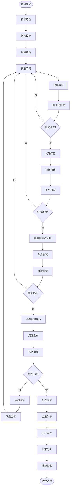

## 2. 技术栈选型决策树

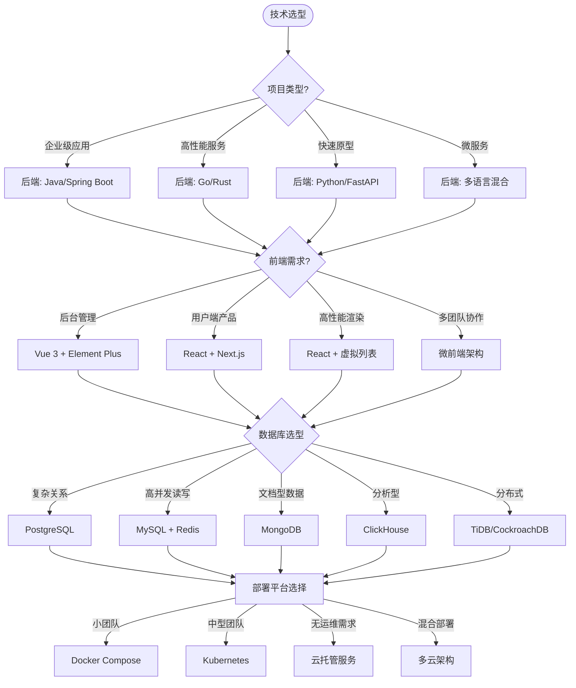

## 3. 微服务架构全景图

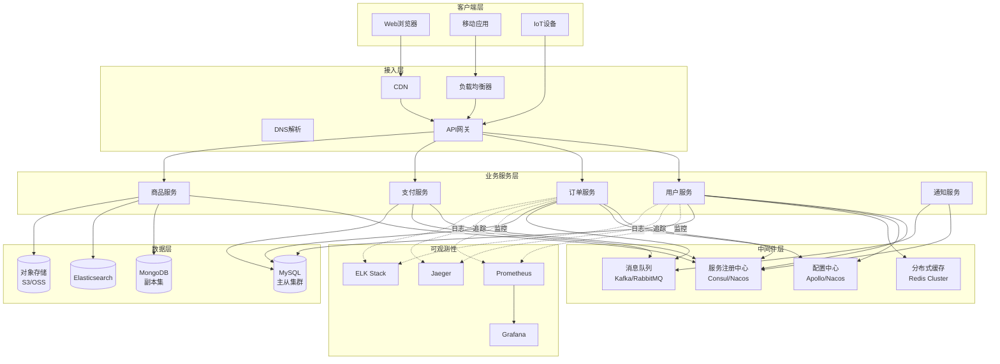

## 4. CI/CD流水线架构

```mermaid
graph LR
    subgraph "代码阶段"
        A1[开发提交代码] --> A2[Git Push]
        A2 --> A3[Webhook触发]
    end

    subgraph "CI阶段"
        A3 --> B1[代码检出]
        B1 --> B2[依赖安装]
        B2 --> B3[代码检查<br/>Lint/Format]
        B3 --> B4[单元测试]
        B4 --> B5[代码覆盖率]
        B5 --> B6[安全扫描<br/>SAST]
        B6 --> B7[构建制品]
    end

    subgraph "镜像阶段"
        B7 --> C1[构建Docker镜像]
        C1 --> C2[镜像扫描<br/>Trivy]
        C2 --> C3[推送到Registry]
    end

    subgraph "CD阶段-测试环境"
        C3 --> D1[部署到测试环境]
        D1 --> D2[健康检查]
        D2 --> D3[集成测试]
        D3 --> D4[E2E测试]
        D4 --> D5{测试通过?}
        D5 -->|否| D6[通知失败]
        D5 -->|是| E1[部署到预发布]
    end

    subgraph "CD阶段-生产环境"
        E1 --> E2[手动审批]
        E2 --> E3[金丝雀发布<br/>5%流量]
        E3 --> E4[监控指标]
        E4 --> E5{指标正常?}
        E5 -->|否| E6[自动回滚]
        E5 -->|是| E7[扩大到50%]
        E7 --> E8[监控指标]
        E8 --> E9{指标正常?}
        E9 -->|否| E6
        E9 -->|是| E10[全量发布]
    end

    E10 --> F1[生产监控]
    F1 --> F2[日志收集]
    F2 --> F3[告警通知]
```

## 5. 数据库分库分表架构

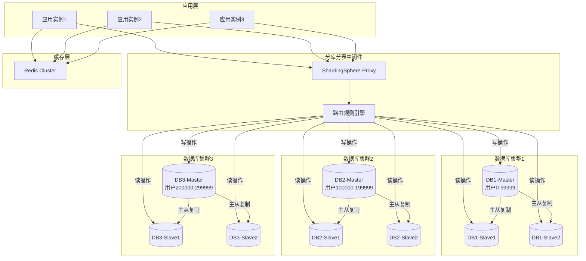

## 6. 高可用架构设计

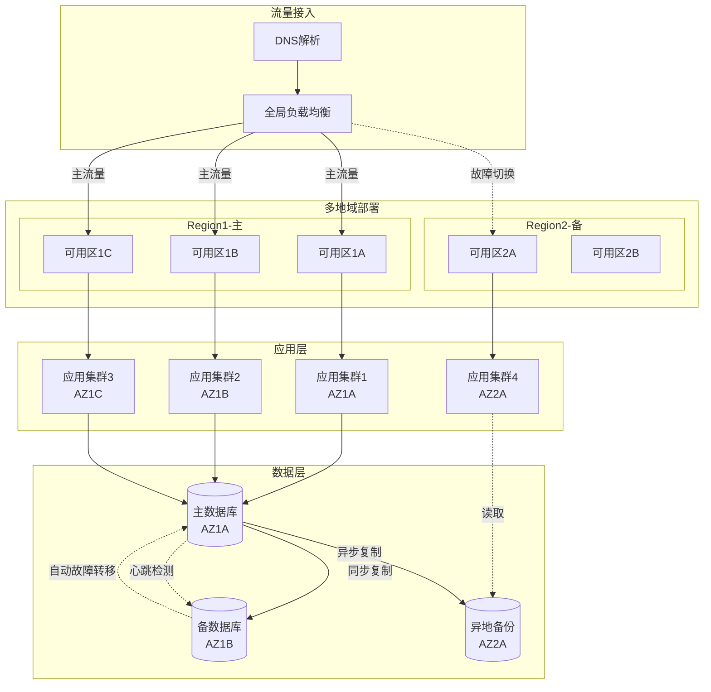

## 7. 监控告警体系

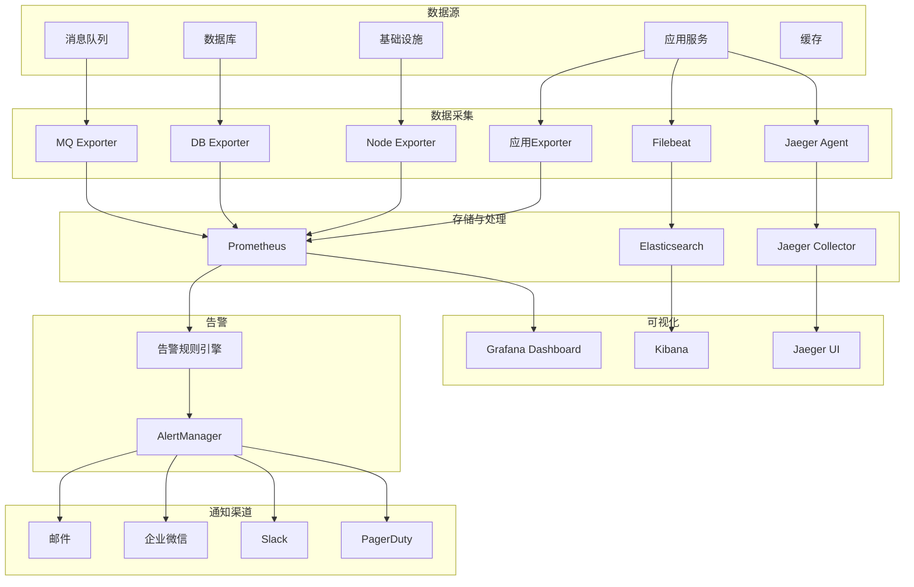

## 8. 安全防护架构

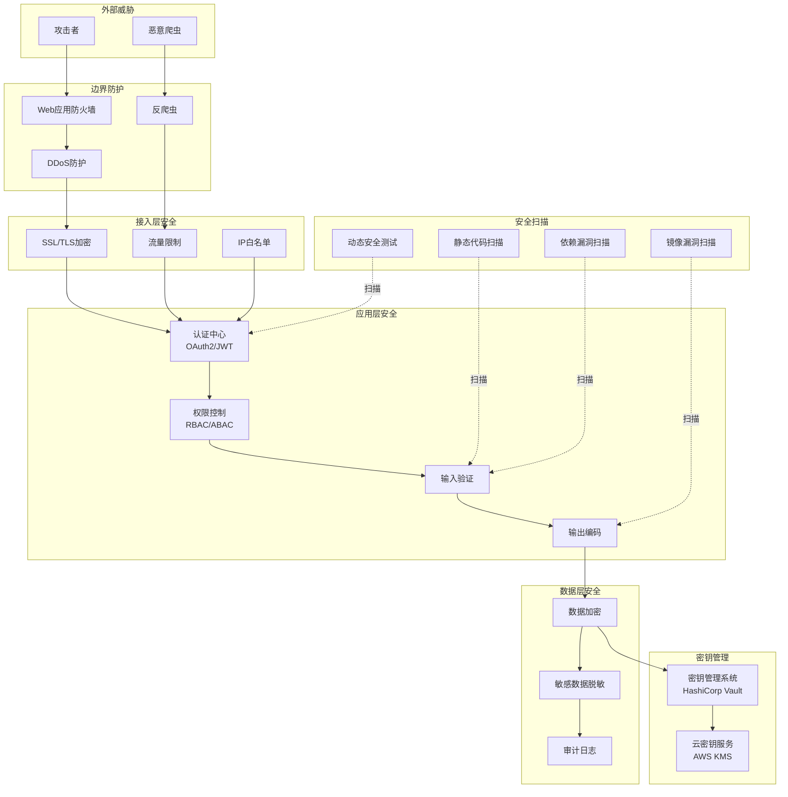

## 9. 配置管理与推送

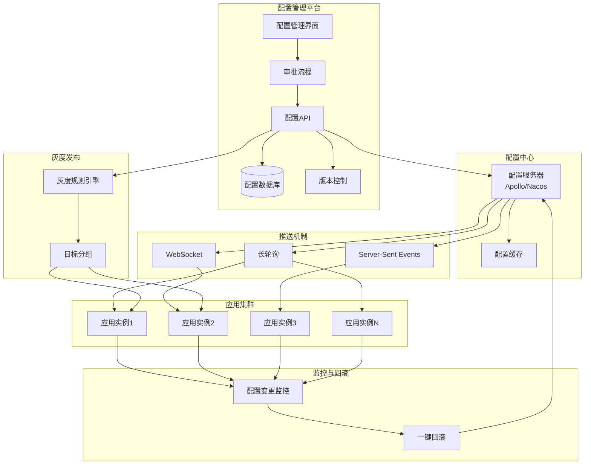

## 10. 全链路压测架构

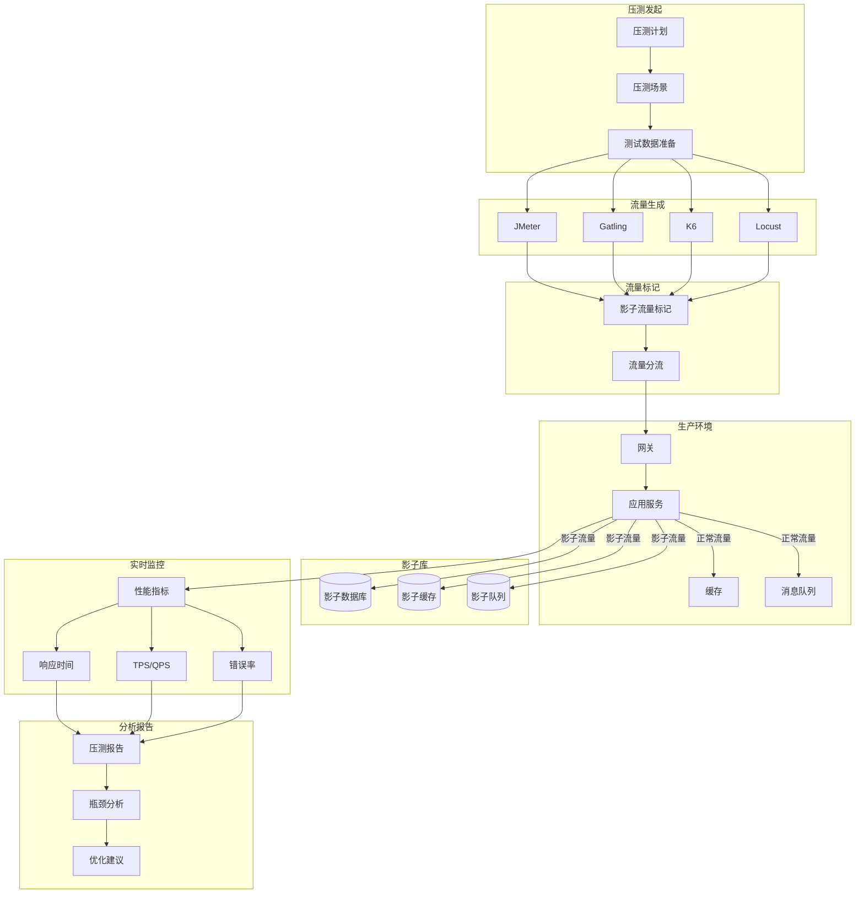

## 11. 日志处理与归档

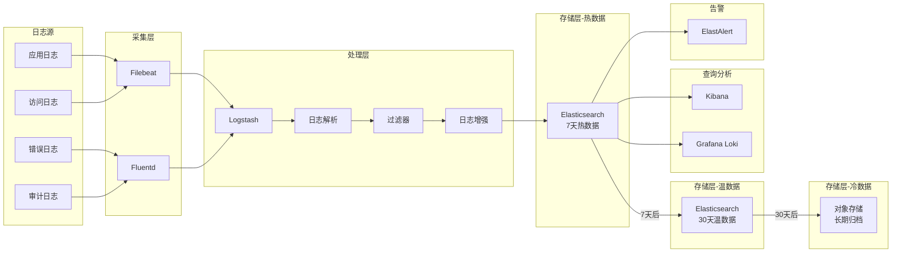

## 12. 故障恢复流程

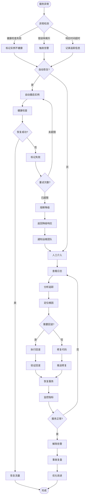

## 13. 版本发布策略对比

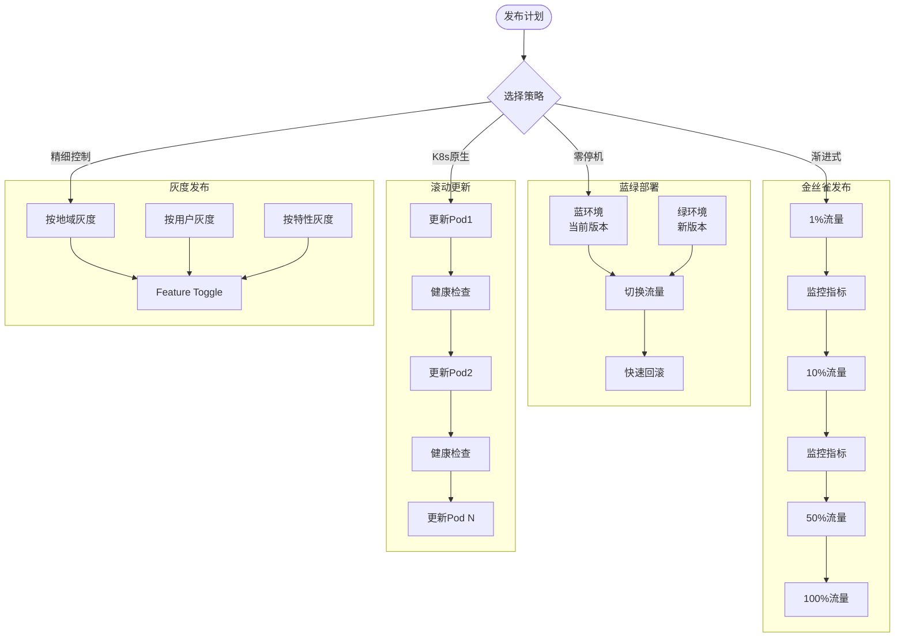

## 14. 技术债务管理

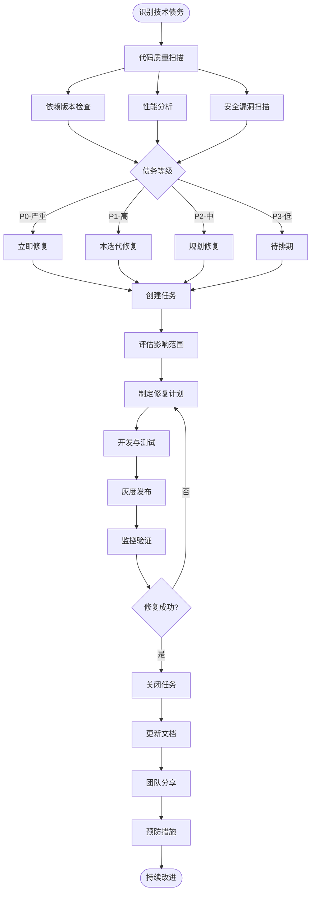

---

## 总结

这些Mermaid图表覆盖了全栈开发的关键架构决策点：

1. **完整生命周期**：从开发到部署到运维的闭环
2. **技术选型决策树**：帮助快速做出技术栈选择
3. **微服务架构**：展示现代分布式系统的全貌
4. **CI/CD流水线**：自动化交付的完整流程
5. **数据库架构**：分库分表与高可用设计
6. **监控告警**：完整的可观测性体系
7. **安全防护**：多层次的安全架构
8. **配置管理**：动态配置的推送与回滚
9. **压测架构**：全链路性能测试
10. **日志处理**：从采集到归档的完整链路
11. **故障恢复**：自动化故障处理流程
12. **发布策略**：多种发布模式的对比
13. **技术债务**：系统化的债务管理流程

每个图表都可以作为实际项目的参考架构，根据具体业务场景进行调整和优化。
