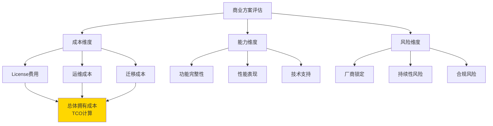
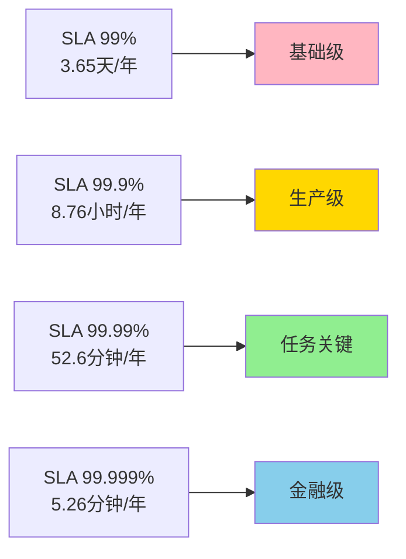
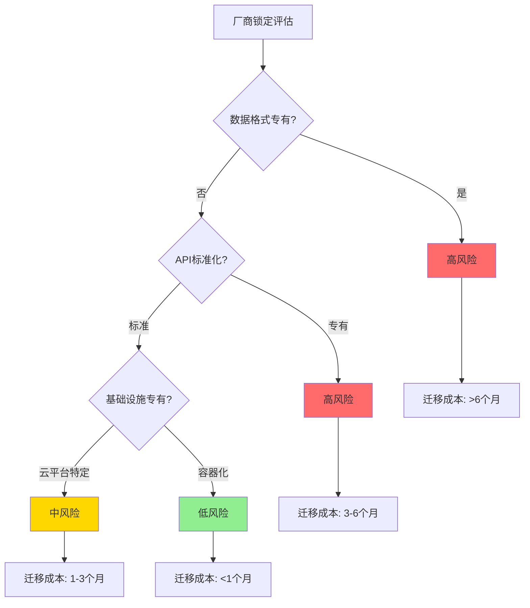
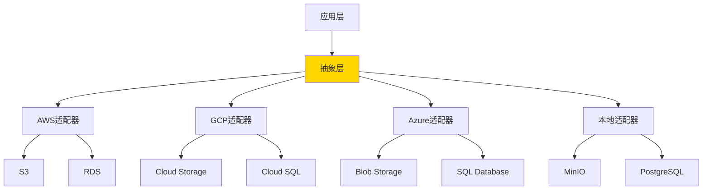

# 商业方案评估标准：License成本、SLA保障、厂商锁定风险

## 评估决策框架



## 1. License成本分析

### 常见License类型对比

| License类型 | 商用限制 | 修改限制 | 分发限制 | 典型软件 |
|------------|---------|---------|---------|---------|
| **MIT** | ✅ 无限制 | ✅ 无限制 | ✅ 无限制 | React, Vue |
| **Apache 2.0** | ✅ 无限制 | ✅ 需标注 | ✅ 需声明专利 | Spring, Kubernetes |
| **GPL v3** | ✅ 可商用 | ✅ 必须开源 | ⚠️ 传染性强 | Linux |
| **AGPL v3** | ⚠️ SaaS需开源 | ✅ 必须开源 | ⚠️ 网络传染 | MongoDB (旧版) |
| **商业License** | 💰 需付费 | ❌ 通常禁止 | ❌ 严格限制 | Oracle, Redis Enterprise |

### License风险评估Checklist

```markdown
## GPL/AGPL风险检查

### 直接依赖检查
- [ ] 扫描项目依赖树 (`gradle dependencies` / `pip-licenses`)
- [ ] 识别GPL/AGPL组件
- [ ] 评估是否通过API/网络调用(降低传染性)

### 传染性分析
- [ ] 静态链接 → 高风险(传染)
- [ ] 动态链接 → 中风险(取决于法律解释)
- [ ] 网络调用 → 低风险(AGPL除外)

### 缓解措施
- [ ] 替换为MIT/Apache组件
- [ ] 使用商业License版本
- [ ] 隔离到独立进程/服务
```

### 商业软件定价模型

#### 模型A: 按核心数/实例数

```yaml
示例: Oracle Database

定价结构:
  标准版:
    - 基础License: $17,500 / CPU核心
    - 年度支持费: 22% (~$3,850 / 核心)
  企业版:
    - 基础License: $47,500 / CPU核心
    - 年度支持费: 22% (~$10,450 / 核心)

实际成本 (8核服务器):
  首年: $47,500 × 8 + $10,450 × 8 = $463,600
  次年起: $10,450 × 8 = $83,600 / 年

开源替代 (PostgreSQL):
  License: $0
  可选商业支持: $2,500-10,000 / 年
  节省: >90%
```

#### 模型B: 订阅制(SaaS)

```yaml
示例: MongoDB Atlas

定价结构:
  免费层: 512MB存储
  共享集群: $9 / 月起
  专用集群:
    M10: $0.08 / 小时 (~$57 / 月)
    M30: $0.54 / 小时 (~$389 / 月)
    M60: $2.50 / 小时 (~$1,800 / 月)

自建成本对比:
  服务器: $200 / 月 (8核32GB)
  运维人力: $8,000 / 月 (1/4 DBA时间)
  总成本: ~$8,200 / 月

结论:
  小规模(<100GB): SaaS更优
  大规模(>1TB): 自建成本优势明显
```

#### 模型C: 按用户数/请求量

```yaml
示例: Auth0 身份认证

定价:
  免费层: 7,000活跃用户
  Essential: $35 / 月 (1,000用户)
  Professional: $240 / 月 (10,000用户)
  Enterprise: 定制报价

开源替代 (Keycloak):
  License: 免费
  运维成本: $3,000 / 月 (云服务器 + 人力)
  决策点: 10,000用户以下可考虑Auth0
```

## 2. SLA保障评估

### SLA等级定义



### 商业支持对比

| 维度 | 开源社区 | 商业支持 | 托管服务 |
|------|---------|---------|---------|
| **响应时间** | 1-7天(论坛) | 1-24小时 | 15分钟-4小时 |
| **可用性SLA** | 无保障 | 99.9% | 99.99%+ |
| **升级支持** | 自行测试 | 协助升级 | 自动升级 |
| **安全补丁** | 及时性不保证 | 优先通知 | 自动修复 |
| **故障赔偿** | 无 | 服务费退还 | 按SLA赔偿 |
| **年度成本** | $0 | $1万-10万 | $5万-50万 |

### SLA条款关键要素

```markdown
## SLA评估Checklist

### 可用性承诺
- [ ] 明确停机时间计算方式(计划内维护是否计入)
- [ ] 是否承诺多区域容灾
- [ ] 故障恢复RTO/RPO目标

### 赔偿条款
- [ ] 违约赔偿比例(通常10%-100%月费)
- [ ] 索赔流程和时限
- [ ] 免责条款(不可抗力范围)

### 服务范围
- [ ] 7×24小时支持级别
- [ ] 技术架构审查
- [ ] 性能调优服务
- [ ] 安全审计

### 升级与迁移
- [ ] 大版本升级支持
- [ ] 数据迁移工具
- [ ] 回滚机制
```

## 3. 厂商锁定风险

### 锁定风险评估模型



### 典型锁定场景分析

#### 场景A: AWS服务深度集成

```yaml
高锁定风险服务:
  - DynamoDB (专有NoSQL)
  - Lambda (Serverless)
  - SQS/SNS (消息队列)
  - Cognito (身份认证)

风险:
  - 数据格式专有
  - API无标准对应
  - 运维工具绑定

缓解方案:
  - 使用抽象层 (Repository模式)
  - 选择兼容服务 (RDS → PostgreSQL)
  - 多云架构 (K8s + Terraform)

示例架构:
  应用层 → 抽象接口 → 适配层 → 云服务
                      ↓
                   本地实现 (测试/迁移)
```

#### 场景B: 数据库厂商锁定

```sql
-- Oracle专有特性
CREATE TABLE orders (
    id NUMBER GENERATED ALWAYS AS IDENTITY,
    data XMLTYPE,  -- 专有数据类型
    created_date DATE DEFAULT SYSDATE
);

-- PL/SQL存储过程
CREATE OR REPLACE PROCEDURE process_order(p_id NUMBER) AS
BEGIN
    -- Oracle专有语法
    DBMS_OUTPUT.PUT_LINE('Processing...');
END;

-- 迁移到PostgreSQL需重写
CREATE TABLE orders (
    id SERIAL PRIMARY KEY,
    data JSON,  -- 标准类型
    created_date TIMESTAMP DEFAULT CURRENT_TIMESTAMP
);

-- 改为PL/pgSQL
CREATE OR REPLACE FUNCTION process_order(p_id INTEGER) RETURNS VOID AS $$
BEGIN
    RAISE NOTICE 'Processing...';
END;
$$ LANGUAGE plpgsql;
```

**迁移成本估算**:
- 评估专有特性使用量: 3-5个工作日
- 改写SQL和存储过程: 2-4个月
- 测试验证: 1-2个月
- 数据迁移: 1周-1个月
- **总计**: 4-7个月,成本$20-50万

#### 场景C: 容器化降低锁定

```yaml
# 推荐架构: Kubernetes + 标准接口

应用部署:
  - 容器化 (Docker)
  - 编排 (Kubernetes)
  - 配置 (ConfigMap/Secrets)

数据存储:
  - 使用标准协议 (PostgreSQL, Redis)
  - 数据导出工具 (pg_dump)
  - 兼容性层 (S3 API → MinIO)

监控日志:
  - Prometheus (指标)
  - Loki (日志)
  - Jaeger (追踪)

迁移便利性:
  - AWS EKS → GCP GKE: 2周
  - 托管K8s → 自建: 1个月
  - 云平台 → 本地: 6周
```

### 多云策略实施



**实现示例**:

```go
// storage/storage.go - 抽象接口
package storage

type ObjectStorage interface {
    Upload(key string, data []byte) error
    Download(key string) ([]byte, error)
    Delete(key string) error
}

// storage/s3.go - AWS实现
type S3Storage struct {
    client *s3.Client
    bucket string
}

func (s *S3Storage) Upload(key string, data []byte) error {
    _, err := s.client.PutObject(context.Background(), &s3.PutObjectInput{
        Bucket: &s.bucket,
        Key:    &key,
        Body:   bytes.NewReader(data),
    })
    return err
}

// storage/minio.go - 开源替代
type MinIOStorage struct {
    client *minio.Client
    bucket string
}

func (m *MinIOStorage) Upload(key string, data []byte) error {
    _, err := m.client.PutObject(context.Background(),
        m.bucket, key, bytes.NewReader(data), int64(len(data)),
        minio.PutObjectOptions{})
    return err
}

// 使用依赖注入
func NewStorage(provider string) ObjectStorage {
    switch provider {
    case "s3":
        return &S3Storage{...}
    case "minio":
        return &MinIOStorage{...}
    default:
        panic("unknown provider")
    }
}
```

## 4. TCO(总体拥有成本)计算模型

### 3年TCO对比

```yaml
场景: 中型电商平台 (10万DAU)

方案A: 全开源自建
  基础设施:
    - 云服务器: $2,000 / 月 × 36 = $72,000
    - 带宽流量: $500 / 月 × 36 = $18,000
  人力成本:
    - DevOps工程师: $10,000 / 月 × 36 = $360,000
    - DBA: $8,000 / 月 × 36 = $288,000
  License: $0
  总计: $738,000

方案B: 混合架构(开源+托管)
  基础设施:
    - K8s托管: $500 / 月 × 36 = $18,000
    - 托管数据库: $800 / 月 × 36 = $28,800
    - CDN: $300 / 月 × 36 = $10,800
  人力成本:
    - DevOps: $10,000 / 月 × 36 = $360,000
  License: $0
  总计: $417,600

方案C: 全商业方案
  基础设施:
    - 企业云服务: $3,000 / 月 × 36 = $108,000
  License:
    - 应用服务器: $50,000 / 年 × 3 = $150,000
    - 数据库: $80,000 / 年 × 3 = $240,000
    - APM监控: $30,000 / 年 × 3 = $90,000
  人力成本:
    - 运维: $8,000 / 月 × 36 = $288,000
  总计: $876,000

推荐: 方案B (节省43% vs 方案C)
```

### ROI计算工具

```python
# tco_calculator.py
class TCOCalculator:
    def __init__(self, years=3):
        self.years = years

    def calculate(self, scenario):
        """计算总体拥有成本"""
        infrastructure = scenario['infrastructure_monthly'] * 12 * self.years
        licenses = scenario['license_annual'] * self.years
        labor = scenario['labor_monthly'] * 12 * self.years
        migration = scenario.get('migration_cost', 0)

        total = infrastructure + licenses + labor + migration

        return {
            'infrastructure': infrastructure,
            'licenses': licenses,
            'labor': labor,
            'migration': migration,
            'total': total,
            'annual_average': total / self.years
        }

# 使用示例
opensource_scenario = {
    'infrastructure_monthly': 2500,
    'license_annual': 0,
    'labor_monthly': 18000,
}

commercial_scenario = {
    'infrastructure_monthly': 3000,
    'license_annual': 160000,
    'labor_monthly': 8000,
}

calc = TCOCalculator(years=3)
print("开源方案TCO:", calc.calculate(opensource_scenario))
print("商业方案TCO:", calc.calculate(commercial_scenario))
```

## 5. 决策矩阵

### 最终评分模型

```yaml
评分维度 (满分100):
  功能完整性: 25分
  技术成熟度: 20分
  总体成本: 20分
  厂商锁定风险: 15分
  社区生态: 10分
  合规性: 10分

示例评估:

方案A (AWS托管服务):
  功能: 23/25 (完善)
  成熟度: 20/20 (非常成熟)
  成本: 12/20 (较贵)
  锁定: 5/15 (高锁定)
  生态: 10/10 (最强)
  合规: 10/10 (齐全)
  总分: 80/100

方案B (开源自建):
  功能: 20/25 (需二次开发)
  成熟度: 18/20 (成熟)
  成本: 18/20 (成本优)
  锁定: 15/15 (无锁定)
  生态: 9/10 (活跃)
  合规: 8/10 (需自行配置)
  总分: 88/100

推荐: 方案B
```

### 快速决策指南

```markdown
## 选择商业方案如果:
- ✅ 团队规模<10人,无专职运维
- ✅ 业务快速迭代,不想关注基础设施
- ✅ 需要SLA保障和7×24支持
- ✅ 合规要求高(金融/医疗)

## 选择开源方案如果:
- ✅ 技术团队>20人
- ✅ 对成本敏感
- ✅ 需要深度定制
- ✅ 避免厂商锁定

## 混合策略(推荐):
- ✅ 核心数据用开源(PostgreSQL)
- ✅ 非核心用托管(日志/监控)
- ✅ 保留迁移能力(抽象层)
```

---

**文档版本**: v1.0
**最后更新**: 2025-11-13
