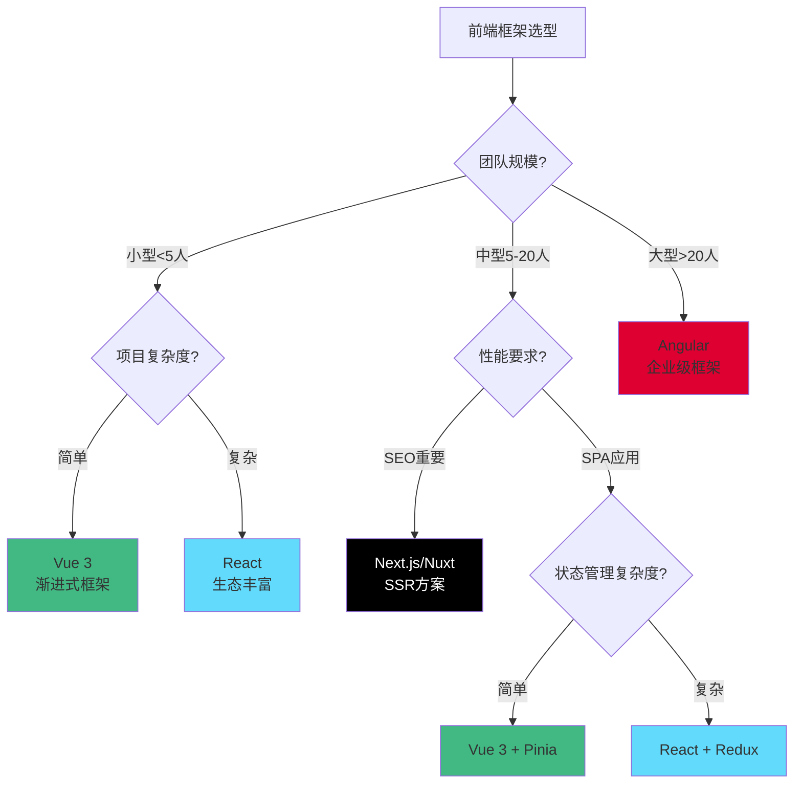
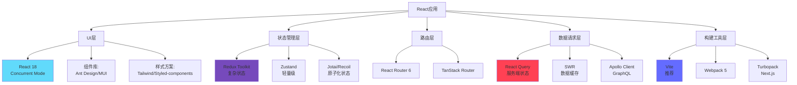
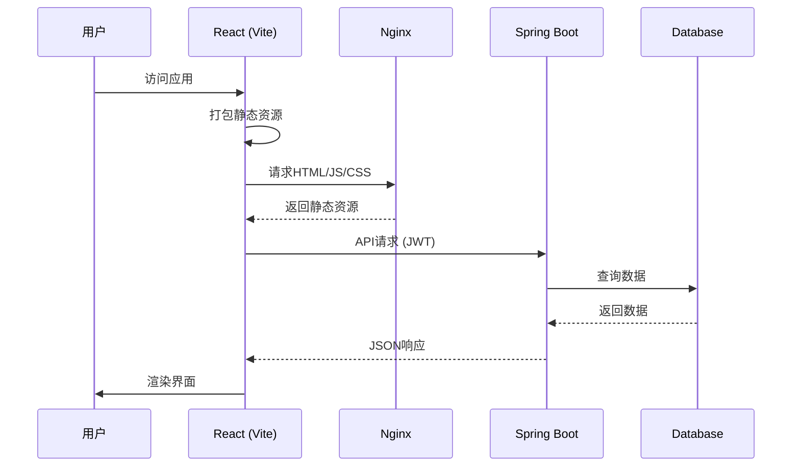
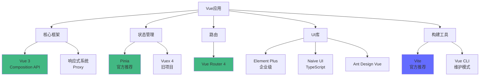
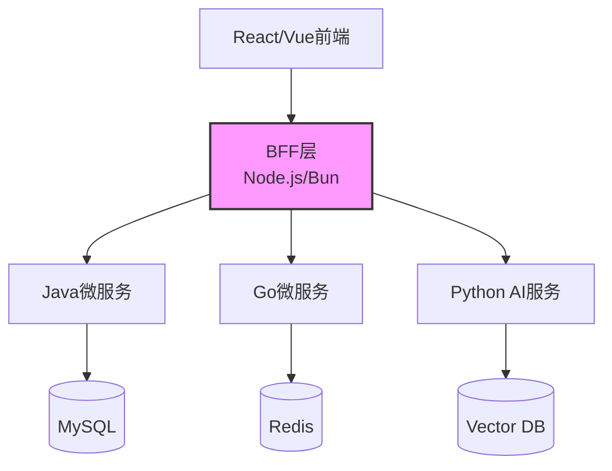
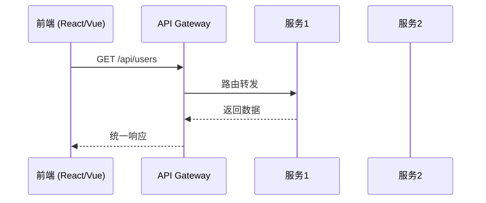
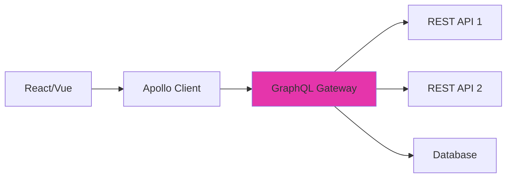
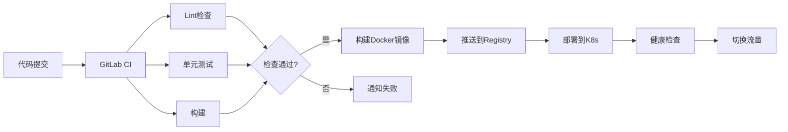

# 框架决策树：Vue/React前端框架与对应后端技术的集成方案

## 前端框架选型决策流程



---

## 1. React生态系统

### 技术栈拓扑图



### 方案A：React + Vite + TypeScript（现代化推荐）

#### 技术栈组合

```json
{
  "dependencies": {
    "react": "^18.2.0",
    "react-dom": "^18.2.0",
    "react-router-dom": "^6.20.0",
    "@tanstack/react-query": "^5.12.0",
    "zustand": "^4.4.7",
    "axios": "^1.6.2",
    "zod": "^3.22.4"
  },
  "devDependencies": {
    "vite": "^5.0.0",
    "typescript": "^5.3.0",
    "@vitejs/plugin-react": "^4.2.0",
    "tailwindcss": "^3.3.6",
    "eslint": "^8.55.0",
    "prettier": "^3.1.0"
  }
}
```

#### 项目结构

```
react-app/
├── src/
│   ├── components/        # 通用组件
│   │   ├── Button.tsx
│   │   └── Modal.tsx
│   ├── features/          # 功能模块（推荐）
│   │   ├── auth/
│   │   │   ├── AuthForm.tsx
│   │   │   ├── useAuth.ts
│   │   │   └── authApi.ts
│   │   └── products/
│   │       ├── ProductList.tsx
│   │       ├── useProducts.ts
│   │       └── productsApi.ts
│   ├── hooks/             # 自定义Hooks
│   │   ├── useLocalStorage.ts
│   │   └── useDebounce.ts
│   ├── services/          # API服务
│   │   └── api.ts
│   ├── stores/            # 状态管理
│   │   └── userStore.ts
│   ├── types/             # TypeScript类型
│   │   └── index.ts
│   ├── utils/             # 工具函数
│   │   └── format.ts
│   ├── App.tsx
│   └── main.tsx
├── public/
├── tests/                 # 测试文件
│   ├── unit/
│   └── e2e/
├── vite.config.ts
├── tsconfig.json
└── tailwind.config.js
```

#### 性能基准

```yaml
构建时间:
  开发启动: 300-500ms (Vite HMR)
  生产构建: 10-30秒
  增量构建: 1-3秒

运行时性能:
  首屏加载: < 1.5秒 (代码分割后)
  交互响应: < 100ms
  包体积:
    - 基础包: ~150KB (gzip)
    - 完整应用: 300-500KB

开发体验:
  热更新: < 50ms
  TypeScript检查: 实时
```

#### 核心代码示例

**1. 自定义Hook + React Query**

```typescript
// features/products/useProducts.ts
import { useQuery, useMutation, useQueryClient } from '@tanstack/react-query';
import { Product } from '@/types';
import * as api from './productsApi';

export function useProducts() {
  const queryClient = useQueryClient();

  // 获取产品列表
  const { data, isLoading, error } = useQuery({
    queryKey: ['products'],
    queryFn: api.fetchProducts,
    staleTime: 5 * 60 * 1000, // 5分钟内数据视为新鲜
    gcTime: 10 * 60 * 1000, // 10分钟后回收缓存
  });

  // 创建产品
  const createMutation = useMutation({
    mutationFn: api.createProduct,
    onSuccess: () => {
      // 自动刷新产品列表
      queryClient.invalidateQueries({ queryKey: ['products'] });
    },
  });

  return {
    products: data,
    isLoading,
    error,
    createProduct: createMutation.mutate,
    isCreating: createMutation.isPending,
  };
}
```

**2. Zustand状态管理**

```typescript
// stores/userStore.ts
import { create } from 'zustand';
import { persist } from 'zustand/middleware';

interface UserState {
  user: User | null;
  token: string | null;
  setUser: (user: User, token: string) => void;
  logout: () => void;
}

export const useUserStore = create<UserState>()(
  persist(
    (set) => ({
      user: null,
      token: null,
      setUser: (user, token) => set({ user, token }),
      logout: () => set({ user: null, token: null }),
    }),
    {
      name: 'user-storage', // localStorage key
    }
  )
);
```

**3. 组件实现**

```typescript
// features/products/ProductList.tsx
import { useProducts } from './useProducts';
import { ProductCard } from '@/components';

export function ProductList() {
  const { products, isLoading, error, createProduct } = useProducts();

  if (isLoading) return <Spinner />;
  if (error) return <ErrorMessage error={error} />;

  return (
    <div className="grid grid-cols-3 gap-4">
      {products?.map(product => (
        <ProductCard
          key={product.id}
          product={product}
        />
      ))}
    </div>
  );
}
```

#### 与后端集成方案

##### A1. React + Spring Boot（企业级推荐）



**配置示例**：

```typescript
// src/services/api.ts
import axios from 'axios';
import { useUserStore } from '@/stores/userStore';

const api = axios.create({
  baseURL: import.meta.env.VITE_API_BASE_URL, // http://localhost:8080/api
  timeout: 10000,
});

// 请求拦截器 - 添加JWT
api.interceptors.request.use((config) => {
  const token = useUserStore.getState().token;
  if (token) {
    config.headers.Authorization = `Bearer ${token}`;
  }
  return config;
});

// 响应拦截器 - 错误处理
api.interceptors.response.use(
  (response) => response.data,
  (error) => {
    if (error.response?.status === 401) {
      useUserStore.getState().logout();
      window.location.href = '/login';
    }
    return Promise.reject(error);
  }
);

export default api;
```

**Spring Boot CORS配置**：

```java
@Configuration
public class WebConfig implements WebMvcConfigurer {
    @Override
    public void addCorsMappings(CorsRegistry registry) {
        registry.addMapping("/api/**")
                .allowedOrigins("http://localhost:5173") // Vite开发服务器
                .allowedMethods("GET", "POST", "PUT", "DELETE")
                .allowedHeaders("*")
                .allowCredentials(true)
                .maxAge(3600);
    }
}
```

##### A2. React + FastAPI（Python栈）

```python
# main.py
from fastapi import FastAPI
from fastapi.middleware.cors import CORSMiddleware
from fastapi.staticfiles import StaticFiles

app = FastAPI()

# CORS配置
app.add_middleware(
    CORSMiddleware,
    allow_origins=["http://localhost:5173"],  # Vite开发服务器
    allow_credentials=True,
    allow_methods=["*"],
    allow_headers=["*"],
)

# API路由
@app.get("/api/products")
async def get_products():
    return {"products": []}

# 生产环境：托管React构建产物
app.mount("/", StaticFiles(directory="dist", html=True), name="static")
```

**部署架构**：

```dockerfile
# 多阶段构建
FROM node:20 AS frontend-build
WORKDIR /app
COPY package*.json ./
RUN npm ci
COPY . .
RUN npm run build

FROM python:3.11-slim
WORKDIR /app
COPY requirements.txt .
RUN pip install --no-cache-dir -r requirements.txt
COPY --from=frontend-build /app/dist ./dist
COPY . .
CMD ["uvicorn", "main:app", "--host", "0.0.0.0", "--port", "8000"]
```

### 方案B：Next.js（SSR/SSG方案）

#### 适用场景

- SEO是核心需求（电商、内容网站）
- 需要首屏快速渲染
- 服务端数据预取

#### 技术栈组合

```json
{
  "dependencies": {
    "next": "^14.0.4",
    "react": "^18.2.0",
    "react-dom": "^18.2.0",
    "@tanstack/react-query": "^5.12.0"
  }
}
```

#### 核心特性

```typescript
// app/products/page.tsx (App Router)
import { Suspense } from 'react';

// 服务端组件 - 默认行为
async function ProductList() {
  // 服务端直接获取数据
  const products = await fetch('http://api/products', {
    next: { revalidate: 60 } // ISR: 60秒后重新生成
  }).then(res => res.json());

  return (
    <div>
      {products.map(p => <ProductCard key={p.id} {...p} />)}
    </div>
  );
}

// 页面组件
export default function Page() {
  return (
    <Suspense fallback={<Loading />}>
      <ProductList />
    </Suspense>
  );
}
```

#### 性能优势

```yaml
首屏性能:
  TTFB (Time to First Byte): 50-200ms
  FCP (First Contentful Paint): 300-600ms
  LCP (Largest Contentful Paint): 500-1000ms

SEO:
  爬虫可见: 100% (服务端渲染)
  结构化数据: 支持
```

---

## 2. Vue生态系统

### 技术栈拓扑图



### 方案A：Vue 3 + Vite + TypeScript

#### 技术栈组合

```json
{
  "dependencies": {
    "vue": "^3.3.10",
    "vue-router": "^4.2.5",
    "pinia": "^2.1.7",
    "axios": "^1.6.2",
    "vueuse": "^10.6.1"
  },
  "devDependencies": {
    "vite": "^5.0.0",
    "typescript": "^5.3.0",
    "@vitejs/plugin-vue": "^4.5.1",
    "unplugin-auto-import": "^0.17.0",
    "unplugin-vue-components": "^0.26.0"
  }
}
```

#### 项目结构

```
vue-app/
├── src/
│   ├── components/        # 通用组件
│   │   ├── BaseButton.vue
│   │   └── BaseModal.vue
│   ├── views/             # 页面视图
│   │   ├── Home.vue
│   │   └── Products/
│   │       ├── Index.vue
│   │       └── Detail.vue
│   ├── composables/       # 组合式函数
│   │   ├── useAuth.ts
│   │   └── useProducts.ts
│   ├── stores/            # Pinia stores
│   │   ├── user.ts
│   │   └── products.ts
│   ├── router/            # 路由配置
│   │   └── index.ts
│   ├── api/               # API层
│   │   └── products.ts
│   ├── types/             # 类型定义
│   │   └── index.ts
│   ├── App.vue
│   └── main.ts
├── public/
├── vite.config.ts
└── tsconfig.json
```

#### 核心代码示例

**1. Composables (Composition API)**

```typescript
// composables/useProducts.ts
import { ref, computed } from 'vue';
import * as api from '@/api/products';

export function useProducts() {
  const products = ref<Product[]>([]);
  const loading = ref(false);
  const error = ref<Error | null>(null);

  // 计算属性
  const totalCount = computed(() => products.value.length);

  // 异步方法
  async function fetchProducts() {
    loading.value = true;
    error.value = null;
    try {
      products.value = await api.fetchProducts();
    } catch (e) {
      error.value = e as Error;
    } finally {
      loading.value = false;
    }
  }

  // 自动清理
  onUnmounted(() => {
    products.value = [];
  });

  return {
    products,
    loading,
    error,
    totalCount,
    fetchProducts,
  };
}
```

**2. Pinia Store**

```typescript
// stores/user.ts
import { defineStore } from 'pinia';
import { ref, computed } from 'vue';

export const useUserStore = defineStore('user', () => {
  // State
  const user = ref<User | null>(null);
  const token = ref<string | null>(null);

  // Getters
  const isLoggedIn = computed(() => !!token.value);

  // Actions
  function setUser(newUser: User, newToken: string) {
    user.value = newUser;
    token.value = newToken;
  }

  function logout() {
    user.value = null;
    token.value = null;
  }

  return {
    user,
    token,
    isLoggedIn,
    setUser,
    logout,
  };
}, {
  persist: true, // 持久化插件
});
```

**3. 组件实现**

```vue
<!-- views/Products/Index.vue -->
<script setup lang="ts">
import { onMounted } from 'vue';
import { useProducts } from '@/composables/useProducts';
import ProductCard from './ProductCard.vue';

const { products, loading, error, fetchProducts } = useProducts();

onMounted(() => {
  fetchProducts();
});
</script>

<template>
  <div class="products-container">
    <div v-if="loading">加载中...</div>
    <div v-else-if="error">错误: {{ error.message }}</div>
    <div v-else class="grid">
      <ProductCard
        v-for="product in products"
        :key="product.id"
        :product="product"
      />
    </div>
  </div>
</template>

<style scoped>
.grid {
  display: grid;
  grid-template-columns: repeat(auto-fill, minmax(250px, 1fr));
  gap: 1rem;
}
</style>
```

#### 与后端集成方案

##### B1. Vue + Go Gin

```go
// main.go
package main

import (
    "github.com/gin-contrib/cors"
    "github.com/gin-gonic/gin"
)

func main() {
    r := gin.Default()

    // CORS配置
    r.Use(cors.New(cors.Config{
        AllowOrigins:     []string{"http://localhost:5173"},
        AllowMethods:     []string{"GET", "POST", "PUT", "DELETE"},
        AllowHeaders:     []string{"Origin", "Content-Type", "Authorization"},
        AllowCredentials: true,
    }))

    // API路由
    api := r.Group("/api")
    {
        api.GET("/products", getProducts)
        api.POST("/products", createProduct)
    }

    // 生产环境：托管Vue构建产物
    r.Static("/assets", "./dist/assets")
    r.StaticFile("/", "./dist/index.html")

    r.Run(":8080")
}
```

**部署架构**：

```yaml
# docker-compose.yml
version: '3.8'
services:
  backend:
    build: ./backend
    ports:
      - "8080:8080"
    environment:
      - DATABASE_URL=postgres://...

  frontend:
    build:
      context: ./frontend
      dockerfile: Dockerfile
    volumes:
      - ./frontend/dist:/app/dist
```

##### B2. Vue + Node.js (Express)

```javascript
// server.js
const express = require('express');
const cors = require('cors');
const path = require('path');

const app = express();

// 开发环境CORS
if (process.env.NODE_ENV !== 'production') {
  app.use(cors({ origin: 'http://localhost:5173' }));
}

// API路由
app.get('/api/products', (req, res) => {
  res.json({ products: [] });
});

// 生产环境：托管Vue构建产物
if (process.env.NODE_ENV === 'production') {
  app.use(express.static(path.join(__dirname, 'dist')));
  app.get('*', (req, res) => {
    res.sendFile(path.join(__dirname, 'dist', 'index.html'));
  });
}

app.listen(3000, () => console.log('Server running on port 3000'));
```

### 方案B：Nuxt 3（SSR/SSG方案）

#### 核心特性

```typescript
// pages/products/[id].vue
<script setup lang="ts">
// 服务端数据获取
const route = useRoute();
const { data: product } = await useFetch(`/api/products/${route.params.id}`, {
  key: `product-${route.params.id}`,
});

// SEO优化
useHead({
  title: product.value?.name,
  meta: [
    { name: 'description', content: product.value?.description }
  ]
});
</script>

<template>
  <div>
    <h1>{{ product.name }}</h1>
    <p>{{ product.description }}</p>
  </div>
</template>
```

---

## 3. React vs Vue 对比矩阵

### 功能对比表

| 维度 | React | Vue | 说明 |
|------|-------|-----|------|
| **学习曲线** | ⭐⭐⭐ | ⭐⭐⭐⭐⭐ | Vue更接近传统Web开发 |
| **生态丰富度** | ⭐⭐⭐⭐⭐ | ⭐⭐⭐⭐ | React社区更庞大 |
| **TypeScript支持** | ⭐⭐⭐⭐⭐ | ⭐⭐⭐⭐⭐ | 均为一等公民 |
| **性能** | ⭐⭐⭐⭐ | ⭐⭐⭐⭐⭐ | Vue编译优化更激进 |
| **企业采用度** | ⭐⭐⭐⭐⭐ | ⭐⭐⭐⭐ | React用于大型应用更多 |
| **移动端支持** | ⭐⭐⭐⭐⭐ (React Native) | ⭐⭐⭐ (Weex/NativeScript) | React Native生态更成熟 |
| **SSR方案** | Next.js ⭐⭐⭐⭐⭐ | Nuxt ⭐⭐⭐⭐⭐ | 均成熟可用 |

### 代码风格对比

#### 同一功能的实现

**React (Hooks)**:
```typescript
function Counter() {
  const [count, setCount] = useState(0);

  useEffect(() => {
    document.title = `Count: ${count}`;
  }, [count]);

  return (
    <button onClick={() => setCount(count + 1)}>
      {count}
    </button>
  );
}
```

**Vue (Composition API)**:
```vue
<script setup lang="ts">
import { ref, watch } from 'vue';

const count = ref(0);

watch(count, (newVal) => {
  document.title = `Count: ${newVal}`;
});
</script>

<template>
  <button @click="count++">{{ count }}</button>
</template>
```

### 性能基准测试

```yaml
初始渲染 (1000个组件):
  React: 45ms
  Vue: 35ms

更新渲染 (100次更新):
  React: 25ms
  Vue: 20ms

包体积 (生产构建):
  React: 42KB (gzip)
  Vue: 34KB (gzip)

内存占用:
  React: ~20MB
  Vue: ~18MB
```

---

## 4. 前后端集成架构模式

### 模式A：BFF (Backend For Frontend)



**优势**：
- 前端团队掌控BFF层
- 聚合多个后端服务
- 减少网络往返

**实现示例**：
```typescript
// bff/src/routes/products.ts
import express from 'express';
import axios from 'axios';

const router = express.Router();

router.get('/products', async (req, res) => {
  // 聚合多个服务
  const [products, inventory, prices] = await Promise.all([
    axios.get('http://product-service/api/products'),
    axios.get('http://inventory-service/api/stock'),
    axios.get('http://price-service/api/prices'),
  ]);

  // 数据组装
  const enrichedProducts = products.data.map(p => ({
    ...p,
    stock: inventory.data[p.id],
    price: prices.data[p.id],
  }));

  res.json(enrichedProducts);
});

export default router;
```

### 模式B：直接API集成



**Nginx配置示例**：
```nginx
server {
    listen 80;
    server_name example.com;

    # 前端静态资源
    location / {
        root /var/www/dist;
        try_files $uri $uri/ /index.html;
    }

    # API代理
    location /api/ {
        proxy_pass http://backend:8080;
        proxy_set_header Host $host;
        proxy_set_header X-Real-IP $remote_addr;
    }
}
```

### 模式C：GraphQL统一层



**Apollo Server配置**：
```typescript
// graphql/server.ts
import { ApolloServer } from '@apollo/server';
import { startStandaloneServer } from '@apollo/server/standalone';

const typeDefs = `#graphql
  type Product {
    id: ID!
    name: String!
    price: Float!
    inventory: Int!
  }

  type Query {
    products: [Product!]!
    product(id: ID!): Product
  }
`;

const resolvers = {
  Query: {
    products: async () => {
      // 聚合多个REST API
      const products = await fetch('http://api/products').then(r => r.json());
      const inventory = await fetch('http://api/inventory').then(r => r.json());

      return products.map(p => ({
        ...p,
        inventory: inventory[p.id] || 0
      }));
    },
  },
};

const server = new ApolloServer({ typeDefs, resolvers });
const { url } = await startStandaloneServer(server, { listen: { port: 4000 } });
console.log(`GraphQL server: ${url}`);
```

---

## 5. 构建与部署流水线

### CI/CD完整流程



### GitLab CI配置示例

```yaml
# .gitlab-ci.yml
stages:
  - lint
  - test
  - build
  - deploy

variables:
  NODE_VERSION: "20"
  DOCKER_REGISTRY: "registry.example.com"

# 前端Lint
lint:frontend:
  stage: lint
  image: node:${NODE_VERSION}
  script:
    - cd frontend
    - npm ci
    - npm run lint
    - npm run type-check

# 前端测试
test:frontend:
  stage: test
  image: node:${NODE_VERSION}
  script:
    - cd frontend
    - npm ci
    - npm run test:unit
  coverage: '/Lines\s*:\s*(\d+\.\d+)%/'

# 前端构建
build:frontend:
  stage: build
  image: node:${NODE_VERSION}
  script:
    - cd frontend
    - npm ci
    - npm run build
  artifacts:
    paths:
      - frontend/dist
    expire_in: 1 day

# Docker镜像构建
build:docker:
  stage: build
  image: docker:24
  services:
    - docker:24-dind
  script:
    - docker build -t ${DOCKER_REGISTRY}/app:${CI_COMMIT_SHA} .
    - docker push ${DOCKER_REGISTRY}/app:${CI_COMMIT_SHA}

# 部署到K8s
deploy:production:
  stage: deploy
  image: bitnami/kubectl:latest
  script:
    - kubectl set image deployment/app app=${DOCKER_REGISTRY}/app:${CI_COMMIT_SHA}
    - kubectl rollout status deployment/app
  only:
    - main
```

### Dockerfile最佳实践

```dockerfile
# 多阶段构建 - 前端
FROM node:20-alpine AS frontend-builder
WORKDIR /app/frontend
COPY frontend/package*.json ./
RUN npm ci --only=production
COPY frontend/ ./
RUN npm run build

# 后端构建 (以Go为例)
FROM golang:1.21-alpine AS backend-builder
WORKDIR /app/backend
COPY backend/go.* ./
RUN go mod download
COPY backend/ ./
RUN CGO_ENABLED=0 go build -o main .

# 最终镜像
FROM alpine:3.18
RUN apk add --no-cache ca-certificates
WORKDIR /app

# 复制后端二进制
COPY --from=backend-builder /app/backend/main ./

# 复制前端构建产物
COPY --from=frontend-builder /app/frontend/dist ./dist

EXPOSE 8080
CMD ["./main"]
```

---

## 6. 监控与可观测性

### 前端监控方案

```typescript
// frontend/src/monitoring/init.ts
import * as Sentry from '@sentry/vue';
import { BrowserTracing } from '@sentry/tracing';

export function initMonitoring(app: App) {
  Sentry.init({
    app,
    dsn: import.meta.env.VITE_SENTRY_DSN,
    integrations: [
      new BrowserTracing({
        routingInstrumentation: Sentry.vueRouterInstrumentation(router),
        tracePropagationTargets: ['api.example.com'],
      }),
    ],
    tracesSampleRate: 0.2, // 20%采样
    environment: import.meta.env.MODE,
    beforeSend(event) {
      // 过滤敏感信息
      if (event.request) {
        delete event.request.cookies;
      }
      return event;
    },
  });
}
```

### 性能监控指标

```yaml
核心Web指标 (Core Web Vitals):
  LCP (Largest Contentful Paint): < 2.5s
  FID (First Input Delay): < 100ms
  CLS (Cumulative Layout Shift): < 0.1

自定义指标:
  API响应时间: P95 < 500ms
  错误率: < 0.1%
  用户活跃度: DAU/MAU比率
```

---

## 7. 决策检查清单

### 选择React如果：

- ✅ 需要移动端APP (React Native)
- ✅ 团队已有React经验
- ✅ 需要极其丰富的第三方库
- ✅ 大型项目，需要严格的代码规范
- ✅ 与其他React生态集成（如Electron）

### 选择Vue如果：

- ✅ 团队有传统Web开发背景
- ✅ 需要快速上手和迭代
- ✅ 中小型项目
- ✅ 需要更好的中文文档和社区
- ✅ 渐进式集成到现有项目

### 避免的错误：

- ❌ 为了技术而技术（盲目跟风）
- ❌ 忽视团队技能现状
- ❌ 过早优化（初期就选复杂架构）
- ❌ 忽视SEO需求（需要SSR时选SPA）
- ❌ 不考虑移动端需求

---

**文档版本**: v1.0
**最后更新**: 2025-11-13
**相关文档**: [语言生态对比](./language-ecosystem.md)
