# 语言生态对比：Java/Python/Go/Rust在前后端场景的适用性分析

## 概览架构图

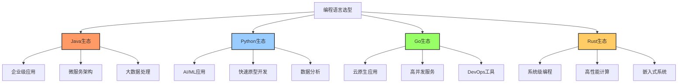

## 1. Java生态系统

### 决策影响因素

| 因素维度 | 评分 | 分析说明 |
|---------|------|---------|
| 团队规模适配 | ⭐⭐⭐⭐⭐ | 中大型团队首选，工程化体系完善 |
| 业务场景 | ⭐⭐⭐⭐⭐ | 金融、电商、企业级应用 |
| SLA要求 | ⭐⭐⭐⭐⭐ | 99.99%可用性保障，成熟监控体系 |
| 招聘难度 | ⭐⭐⭐⭐ | 人才市场充足，学习曲线平缓 |
| 性能表现 | ⭐⭐⭐⭐ | JIT优化后接近C++性能 |

### 典型实施方案

#### 方案A：Spring Boot微服务栈（推荐指数：⭐⭐⭐⭐⭐）

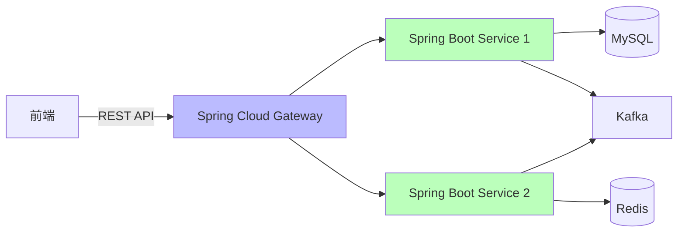

**技术栈组合**：
- **Web框架**: Spring Boot 3.x (基于Spring 6 + Java 17+)
- **API网关**: Spring Cloud Gateway + Resilience4j
- **服务注册**: Nacos / Eureka
- **配置中心**: Apollo / Spring Cloud Config
- **消息队列**: Kafka / RabbitMQ
- **缓存**: Redis + Caffeine (本地缓存)
- **数据库**: MySQL 8.0 + MyBatis-Plus / JPA
- **监控**: Micrometer + Prometheus + Grafana

**性能基准**：
```yaml
单机QPS: 8000-15000 (简单业务逻辑)
P99延迟: < 50ms
内存占用: 512MB-2GB (JVM堆内存)
启动时间: 15-30秒
```

**风险控制点**：
1. **内存泄漏风险**
   - 缓解措施：启用JVM监控 (jstat/VisualVM)，定期Full GC分析
   - 回滚方案：快速重启策略 (K8s健康检查)

2. **启动时间过长**
   - 缓解措施：使用GraalVM Native Image (启动<1秒)
   - 权衡：编译时间增加，动态特性受限

3. **依赖冲突**
   - 缓解措施：Maven/Gradle依赖锁定，使用BOM管理
   - 工具：`mvn dependency:tree`检查

#### 方案B：传统Java EE栈（遗留系统）

**技术栈组合**：
- **容器**: Tomcat / JBoss / WebLogic
- **框架**: Spring MVC / Struts2
- **ORM**: Hibernate / iBatis
- **前端**: JSP + jQuery

**演进路线图**：
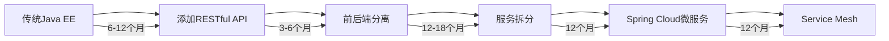

### 开源 vs 商业方案对比

| 组件类型 | 开源方案 | 商业方案 | 对比分析 |
|---------|---------|---------|---------|
| **应用服务器** | Tomcat / Jetty | WebLogic / WebSphere | 商业版提供7x24支持，开源版社区活跃 |
| **服务注册** | Nacos / Eureka | Consul Enterprise | 商业版提供多数据中心同步 |
| **配置中心** | Apollo | Spring Cloud Config Server | Apollo功能更完善，商业版提供审计 |
| **监控APM** | SkyWalking / Zipkin | Dynatrace / New Relic | 商业版AI诊断能力强，成本高 |
| **数据库** | MySQL / PostgreSQL | Oracle / SQL Server | Oracle事务性能更强，License昂贵 |

### License分析

**主流框架License**：
- Spring Framework: Apache 2.0 (✅ 商用友好)
- Hibernate: LGPL 2.1 (⚠️ 需注意动态链接)
- MyBatis: Apache 2.0 (✅ 商用友好)
- Kafka: Apache 2.0 (✅ 商用友好)

**风险提示**：
- Oracle JDK 11+商业使用需付费 → 推荐 **OpenJDK / Amazon Corretto**
- MySQL 8.0 GPL协议 → 使用JDBC连接无传染性

---

## 2. Python生态系统

### 决策影响因素

| 因素维度 | 评分 | 分析说明 |
|---------|------|---------|
| 开发效率 | ⭐⭐⭐⭐⭐ | 代码量仅Java的1/3，快速迭代 |
| AI/ML集成 | ⭐⭐⭐⭐⭐ | 事实上的AI标准语言 |
| 并发性能 | ⭐⭐ | GIL限制，需使用异步或多进程 |
| 企业级支持 | ⭐⭐⭐ | 生态分散，大型项目需架构设计 |
| 类型安全 | ⭐⭐ | 动态类型，需依赖mypy等工具 |

### 典型实施方案

#### 方案A：FastAPI现代异步栈（推荐指数：⭐⭐⭐⭐⭐）

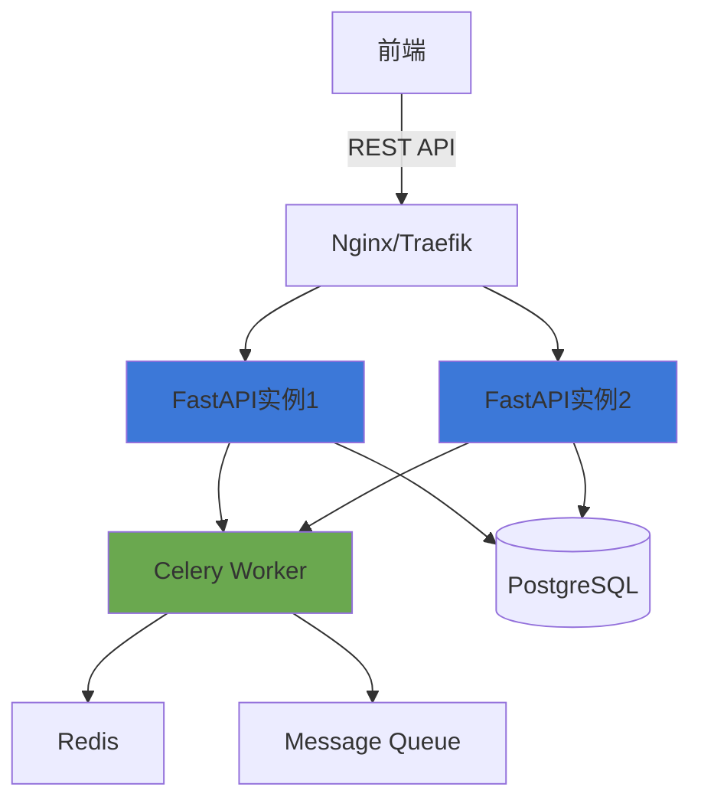

**技术栈组合**：
```python
# 核心依赖
fastapi==0.104.1       # 异步Web框架
uvicorn==0.24.0        # ASGI服务器
pydantic==2.5.0        # 数据验证
sqlalchemy==2.0.23     # ORM
alembic==1.12.1        # 数据库迁移
celery==5.3.4          # 异步任务队列
redis==5.0.1           # 缓存&消息
```

**性能基准**：
```yaml
单机QPS: 10000-20000 (异步处理)
P99延迟: < 30ms
内存占用: 100-300MB
启动时间: 1-3秒
```

**典型架构代码**：
```python
from fastapi import FastAPI, Depends
from sqlalchemy.ext.asyncio import AsyncSession
from typing import List

app = FastAPI(
    title="Enterprise API",
    version="1.0.0",
    docs_url="/api/docs"  # Swagger UI
)

# 依赖注入 - 数据库会话
async def get_db() -> AsyncSession:
    async with AsyncSessionLocal() as session:
        yield session

# RESTful端点
@app.get("/api/v1/users", response_model=List[UserSchema])
async def list_users(
    skip: int = 0,
    limit: int = 100,
    db: AsyncSession = Depends(get_db)
):
    result = await db.execute(
        select(User).offset(skip).limit(limit)
    )
    return result.scalars().all()

# 健康检查
@app.get("/health")
async def health_check():
    return {"status": "healthy"}
```

**风险控制点**：
1. **GIL并发限制**
   - 缓解措施：使用`asyncio`异步编程 + Gunicorn多进程
   - 配置示例：`gunicorn -w 4 -k uvicorn.workers.UvicornWorker`

2. **依赖版本冲突**
   - 缓解措施：Poetry/Pipenv锁定依赖
   - 工具：`pip-audit`安全扫描

3. **类型错误**
   - 缓解措施：强制使用`mypy --strict`静态检查
   - CI集成：pre-commit hooks

#### 方案B：Django全栈框架（推荐指数：⭐⭐⭐⭐）

**技术栈组合**：
- Django 4.2 LTS + Django REST Framework
- Celery + Redis (异步任务)
- PostgreSQL + pgBouncer (连接池)
- Django Channels (WebSocket支持)

**适用场景**：
- 后台管理系统（内置Admin）
- 需要快速开发CRUD接口
- 团队Python经验丰富

**性能基准**：
```yaml
单机QPS: 2000-5000 (同步模式)
P99延迟: 50-100ms
内存占用: 200-500MB
启动时间: 3-5秒
```

### 开源 vs 商业方案对比

| 组件类型 | 开源方案 | 商业方案 | 对比分析 |
|---------|---------|---------|---------|
| **WSGI服务器** | Gunicorn / uWSGI | - | 开源方案成熟稳定 |
| **任务队列** | Celery + Redis | AWS SQS + Lambda | 商业版运维成本低 |
| **监控** | Sentry (开源版) | Sentry Enterprise | 商业版提供SSO和高级告警 |
| **数据库** | PostgreSQL | Amazon RDS | RDS自动备份和故障转移 |

### 演进路线图

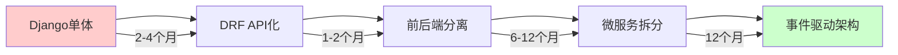

---

## 3. Go生态系统

### 决策影响因素

| 因素维度 | 评分 | 分析说明 |
|---------|------|---------|
| 并发性能 | ⭐⭐⭐⭐⭐ | 原生协程支持，百万级并发 |
| 部署便捷性 | ⭐⭐⭐⭐⭐ | 单二进制文件，容器化友好 |
| 学习曲线 | ⭐⭐⭐⭐ | 语法简洁，但需理解并发模型 |
| 生态成熟度 | ⭐⭐⭐ | 云原生领域领先，Web框架较新 |
| 企业采用度 | ⭐⭐⭐⭐ | 大厂基础设施标配 |

### 典型实施方案

#### 方案A：Gin微服务栈（推荐指数：⭐⭐⭐⭐⭐）

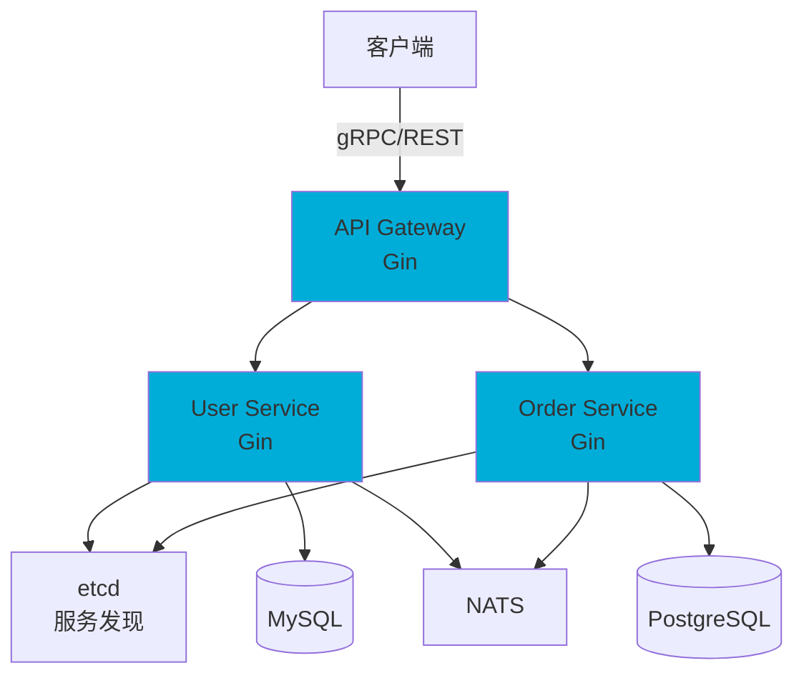

**技术栈组合**：
```go
// go.mod 核心依赖
require (
    github.com/gin-gonic/gin v1.9.1           // Web框架
    github.com/grpc-ecosystem/grpc-gateway v2  // gRPC网关
    go.uber.org/zap v1.26.0                    // 日志
    github.com/spf13/viper v1.17.0             // 配置管理
    gorm.io/gorm v1.25.5                       // ORM
    github.com/redis/go-redis/v9 v9.3.0        // Redis客户端
    go.etcd.io/etcd/client/v3 v3.5.10          // 服务注册
)
```

**性能基准**：
```yaml
单机QPS: 50000-100000 (简单路由)
P99延迟: < 5ms
内存占用: 20-100MB
启动时间: < 1秒
Goroutine数量: 根据负载动态调整
```

**典型架构代码**：
```go
package main

import (
    "context"
    "github.com/gin-gonic/gin"
    "go.uber.org/zap"
    "gorm.io/gorm"
)

type UserService struct {
    db     *gorm.DB
    logger *zap.Logger
    cache  *redis.Client
}

// RESTful接口
func (s *UserService) ListUsers(c *gin.Context) {
    ctx := c.Request.Context()

    // 分布式追踪
    span, ctx := opentracing.StartSpanFromContext(ctx, "ListUsers")
    defer span.Finish()

    var users []User
    if err := s.db.WithContext(ctx).Find(&users).Error; err != nil {
        s.logger.Error("query failed", zap.Error(err))
        c.JSON(500, gin.H{"error": err.Error()})
        return
    }

    c.JSON(200, users)
}

// 并发处理示例
func (s *UserService) BatchProcess(ctx context.Context, ids []int64) error {
    // 使用 errgroup 进行并发控制
    g, ctx := errgroup.WithContext(ctx)
    g.SetLimit(10) // 最大并发数

    for _, id := range ids {
        id := id // 闭包变量捕获
        g.Go(func() error {
            return s.processUser(ctx, id)
        })
    }

    return g.Wait()
}
```

**风险控制点**：
1. **Goroutine泄漏**
   - 检测工具：`goleak`库，`pprof`分析
   - 缓解措施：使用`context.WithTimeout`强制超时

2. **依赖管理**
   - 版本锁定：`go mod vendor`
   - 安全扫描：`govulncheck`

3. **错误处理**
   - 最佳实践：避免`panic`，使用`error`返回
   - 工具：`errcheck`静态分析

#### 方案B：云原生工具栈

**典型项目**：
- Kubernetes (容器编排)
- Prometheus (监控)
- Consul (服务网格)
- Terraform (基础设施即代码)

**适用场景**：
- DevOps工具开发
- 云平台SDK
- 高性能API网关

### 演进路线图

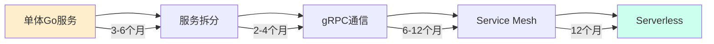

---

## 4. Rust生态系统

### 决策影响因素

| 因素维度 | 评分 | 分析说明 |
|---------|------|---------|
| 内存安全 | ⭐⭐⭐⭐⭐ | 编译期保证，零成本抽象 |
| 性能表现 | ⭐⭐⭐⭐⭐ | 接近C++，优于Java/Go |
| 学习曲线 | ⭐⭐ | 所有权系统复杂，学习周期长 |
| 生态成熟度 | ⭐⭐⭐ | Web框架较新，系统编程领域成熟 |
| 团队适配 | ⭐⭐ | 招聘困难，需长期培训 |

### 典型实施方案

#### 方案A：Actix-web/Axum高性能服务（推荐指数：⭐⭐⭐⭐）

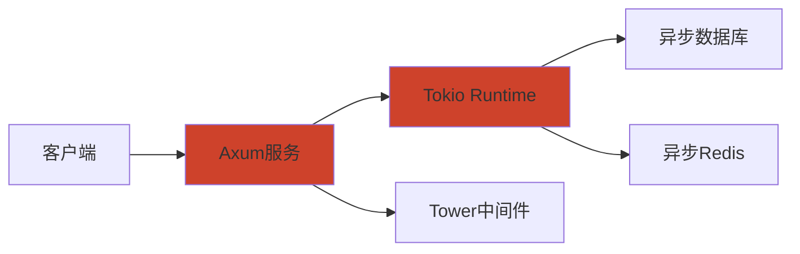

**技术栈组合**：
```toml
# Cargo.toml
[dependencies]
axum = "0.7"              # Web框架
tokio = { version = "1", features = ["full"] }
sqlx = "0.7"              # 异步数据库
redis = { version = "0.24", features = ["tokio-comp"] }
serde = { version = "1.0", features = ["derive"] }
tracing = "0.1"           # 日志追踪
```

**性能基准**：
```yaml
单机QPS: 100000-200000
P99延迟: < 2ms
内存占用: 10-50MB
启动时间: < 500ms
编译时间: 2-5分钟 (增量编译更快)
```

**典型代码**：
```rust
use axum::{Router, routing::get, Json};
use sqlx::PgPool;
use serde::{Deserialize, Serialize};

#[derive(Serialize, Deserialize)]
struct User {
    id: i64,
    name: String,
}

async fn list_users(
    axum::extract::State(pool): axum::extract::State<PgPool>
) -> Result<Json<Vec<User>>, StatusCode> {
    let users = sqlx::query_as!(User, "SELECT id, name FROM users")
        .fetch_all(&pool)
        .await
        .map_err(|_| StatusCode::INTERNAL_SERVER_ERROR)?;

    Ok(Json(users))
}

#[tokio::main]
async fn main() {
    let pool = PgPool::connect("postgres://...").await.unwrap();

    let app = Router::new()
        .route("/users", get(list_users))
        .with_state(pool);

    axum::Server::bind(&"0.0.0.0:3000".parse().unwrap())
        .serve(app.into_make_service())
        .await
        .unwrap();
}
```

**风险控制点**：
1. **编译时间过长**
   - 缓解措施：使用`sccache`缓存，增量编译
   - CI优化：Docker层缓存依赖

2. **异步生态复杂**
   - 缓解措施：统一使用`tokio`运行时，避免混用
   - 学习资源：Rust异步编程书籍

3. **招聘困难**
   - 缓解措施：内部培训计划，从系统编程场景切入
   - 妥协方案：核心模块用Rust，业务逻辑用其他语言

### 适用场景

- **高性能计算**：金融交易系统、游戏服务器
- **系统编程**：操作系统组件、数据库引擎
- **WebAssembly**：浏览器端高性能计算
- **嵌入式**：IoT设备、固件开发

### 演进路线图

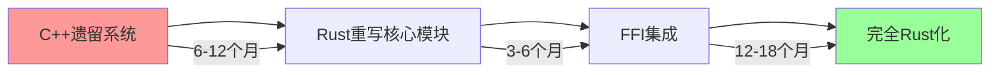

---

## 综合对比矩阵

### 场景推荐表

| 场景 | 推荐语言 | 理由 | 备选方案 |
|------|---------|------|---------|
| 企业级电商系统 | Java | 生态完整，人才充足 | Go (性能优先) |
| AI应用后端 | Python | 模型集成便捷 | - |
| 高并发API网关 | Go | 并发性能优秀 | Rust (极致性能) |
| 实时交易系统 | Rust | 内存安全+高性能 | C++ (生态更成熟) |
| 后台管理系统 | Python (Django) | 开发效率高 | Java (Spring Boot) |
| 云原生工具 | Go | 容器化友好 | Rust (CLI工具) |
| IoT边缘计算 | Rust | 资源占用低 | Go (开发效率) |

### 技术成熟度雷达图

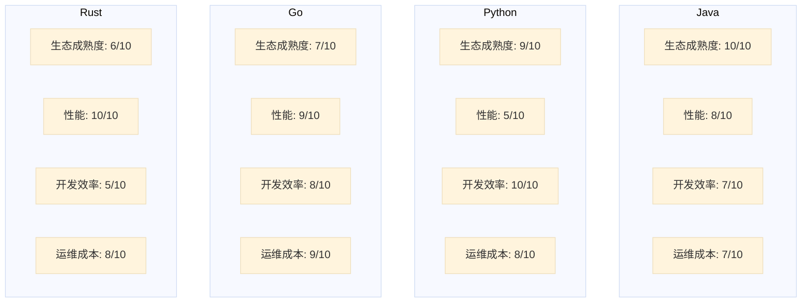

### 成本分析

| 成本项 | Java | Python | Go | Rust |
|-------|------|--------|----|----|
| **人力成本** | 中 | 中 | 中 | 高 |
| **培训成本** | 低 | 低 | 中 | 高 |
| **服务器成本** | 高 | 中 | 低 | 极低 |
| **License成本** | 低(OpenJDK) | 无 | 无 | 无 |
| **运维成本** | 中 | 中 | 低 | 低 |

---

## 决策流程图

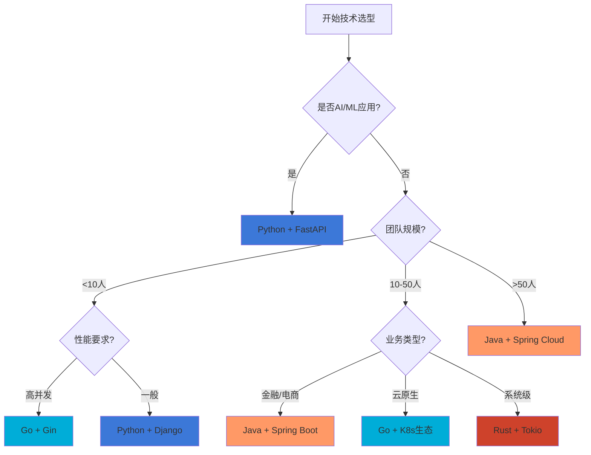

---

## 实践案例

### 案例1：从Python迁移到Go（某视频平台）

**背景**：
- 原Django单体应用，QPS瓶颈2000
- Python多进程占用内存过高（16GB+）

**迁移过程**：
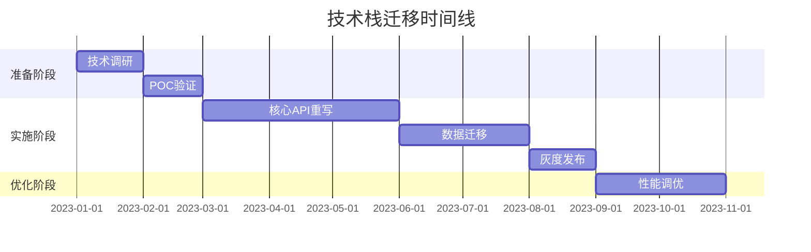

**效果**：
- QPS提升至50000
- 内存占用降低至2GB
- 部署实例减少80%

### 案例2：Java遗留系统现代化（某银行）

**技术债务**：
- JDK 8 + Spring 4.x
- 单体应用，代码30万行
- 部署周期2周

**演进策略**：
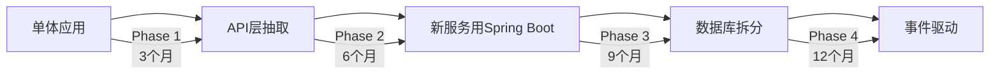

---

## 总结建议

### 快速决策指南

1. **选Java如果**：
   - 大型企业，需要完整的工程体系
   - 团队技术栈已是Java
   - 需要成熟的事务处理和监控

2. **选Python如果**：
   - 涉及AI/ML场景
   - 快速MVP验证
   - 数据分析和脚本自动化

3. **选Go如果**：
   - 云原生应用
   - 高并发场景
   - 需要轻量级部署

4. **选Rust如果**：
   - 性能和安全是首要考虑
   - 系统级编程
   - 团队有足够学习时间

### 避免的陷阱

❌ **错误决策模式**：
- 为了技术而技术（盲目追新）
- 忽视团队技能现状
- 低估迁移成本
- 过早微服务化

✅ **正确决策模式**：
- 基于业务场景选型
- 考虑长期演进路径
- 平衡性能和开发效率
- 建立技术评估机制

---

**文档版本**: v1.0
**最后更新**: 2025-11-13
**审阅者**: 技术架构组
