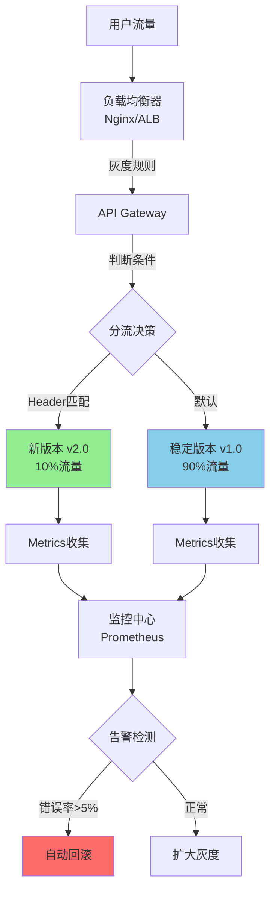
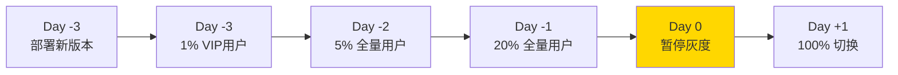

# 灰度发布流程设计：基于Header/Cookie/Weight的分流机制

## 灰度发布架构拓扑



## 1. 三大分流策略

### 策略A: Header/Cookie定向灰度（白名单）

#### Nginx配置实现

```nginx
# nginx.conf
upstream backend_v1 {
    server 10.0.1.10:8080 weight=9;
    server 10.0.1.11:8080 weight=9;
}

upstream backend_v2 {
    server 10.0.2.10:8080 weight=1;
}

map $http_x_canary_version $backend_pool {
    "v2" backend_v2;      # Header: X-Canary-Version: v2
    default backend_v1;
}

map $cookie_canary $backend_pool {
    "enabled" backend_v2;  # Cookie: canary=enabled
    default $backend_pool;
}

server {
    listen 80;

    location /api/ {
        proxy_pass http://$backend_pool;
        proxy_set_header Host $host;
        proxy_set_header X-Real-IP $remote_addr;

        # 追踪灰度版本
        add_header X-Canary-Backend $backend_pool;
    }
}
```

#### 使用场景

```yaml
内部测试阶段:
  策略: Header白名单
  用户: 开发团队、QA团队
  实现: 浏览器插件添加Header

Beta用户测试:
  策略: Cookie标记
  用户: 注册Beta计划的用户
  实现: 后端设置Cookie

合作伙伴验证:
  策略: IP白名单 + Header
  用户: 特定企业客户
  实现: Nginx geo模块
```

### 策略B: 百分比权重灰度（渐进式）

#### Kubernetes基于Istio实现

```yaml
# virtual-service.yaml
apiVersion: networking.istio.io/v1beta1
kind: VirtualService
metadata:
  name: product-service
spec:
  hosts:
  - product-service
  http:
  - match:
    - headers:
        x-canary:
          exact: "true"
    route:
    - destination:
        host: product-service
        subset: v2
  - route:
    - destination:
        host: product-service
        subset: v1
      weight: 90
    - destination:
        host: product-service
        subset: v2
      weight: 10  # 10%流量到新版本
---
apiVersion: networking.istio.io/v1beta1
kind: DestinationRule
metadata:
  name: product-service
spec:
  host: product-service
  subsets:
  - name: v1
    labels:
      version: v1.0
  - name: v2
    labels:
      version: v2.0
```

#### 灰度阶段规划

```mermaid
gantt
    title 灰度发布时间线
    dateFormat  HH:mm
    axisFormat  %H:%M

    section 准备阶段
    部署v2实例           :done, prep1, 09:00, 30m
    健康检查通过         :done, prep2, after prep1, 10m

    section 灰度阶段
    5%流量              :active, gray1, 09:40, 1h
    监控指标            :gray1m, 09:40, 1h
    10%流量             :gray2, 10:40, 2h
    25%流量             :gray3, 12:40, 2h
    50%流量             :gray4, 14:40, 1h
    100%流量            :gray5, 15:40, 30m

    section 清理阶段
    下线v1实例          :clean, 16:10, 20m
```



#### 自动化灰度脚本

```bash
#!/bin/bash
# canary-rollout.sh

VERSIONS=("5" "10" "25" "50" "100")
SERVICE="product-service"
NAMESPACE="production"

for weight in "${VERSIONS[@]}"; do
    echo "🚀 增加灰度至 ${weight}%..."

    # 更新Istio权重
    kubectl apply -f - <<EOF
apiVersion: networking.istio.io/v1beta1
kind: VirtualService
metadata:
  name: ${SERVICE}
  namespace: ${NAMESPACE}
spec:
  hosts:
  - ${SERVICE}
  http:
  - route:
    - destination:
        host: ${SERVICE}
        subset: v1
      weight: $((100 - weight))
    - destination:
        host: ${SERVICE}
        subset: v2
      weight: ${weight}
EOF

    # 等待观察期
    echo "⏳ 观察 30 分钟..."
    sleep 1800

    # 检查错误率
    ERROR_RATE=$(curl -s "http://prometheus:9090/api/v1/query?query=rate(http_requests_total{status=~\"5..\",version=\"v2\"}[5m])" | jq -r '.data.result[0].value[1]')

    if (( $(echo "$ERROR_RATE > 0.05" | bc -l) )); then
        echo "❌ 错误率超标: ${ERROR_RATE}, 执行回滚!"
        kubectl rollout undo deployment/${SERVICE}-v2 -n ${NAMESPACE}
        exit 1
    fi

    echo "✅ 指标正常,继续灰度"
done

echo "🎉 灰度发布完成!"
```

### 策略C: 地域/用户属性灰度

#### Kong API Gateway配置

```yaml
# kong.yml
_format_version: "3.0"

services:
  - name: product-api
    url: http://backend-v1:8080
    routes:
      - name: product-route
        paths:
          - /api/products

plugins:
  - name: canary
    service: product-api
    config:
      # 基于用户属性
      upstream_fallback: false
      upstream_host: backend-v2:8080
      upstream_port: 8080
      percentage: 10

      # 高级规则
      groups:
        - group: beta-users
          upstream_host: backend-v2:8080
          percentage: 100
        - group: cn-users
          upstream_host: backend-v1:8080  # 中国用户保持稳定版
          percentage: 0
```

#### 用户分组逻辑

```javascript
// middleware/canary-routing.js
const canaryRules = {
  // VIP用户优先体验新功能
  vip: (user) => user.tier === 'premium',

  // 地域限制(先在小市场验证)
  region: (user) => ['SG', 'AU'].includes(user.country),

  // A/B测试分组
  experiment: (user) => {
    const hash = crypto.createHash('md5').update(user.id).digest('hex');
    return parseInt(hash.substr(0, 2), 16) < 25; // 约10%
  }
};

module.exports = (req, res, next) => {
  const user = req.user;
  const isCanary = Object.values(canaryRules).some(rule => rule(user));

  req.headers['x-canary-enabled'] = isCanary ? 'true' : 'false';
  next();
};
```

## 2. 监控与回滚机制

### 核心指标监控

```yaml
# prometheus-rules.yml
groups:
  - name: canary-alerts
    interval: 30s
    rules:
      # 错误率告警
      - alert: CanaryHighErrorRate
        expr: |
          rate(http_requests_total{status=~"5..",version="v2"}[5m])
          / rate(http_requests_total{version="v2"}[5m]) > 0.05
        for: 5m
        labels:
          severity: critical
        annotations:
          summary: "新版本错误率超过5%"

      # 响应时间告警
      - alert: CanarySlowResponse
        expr: |
          histogram_quantile(0.95,
            rate(http_request_duration_seconds_bucket{version="v2"}[5m])
          ) > 1.0
        for: 10m
        labels:
          severity: warning
        annotations:
          summary: "新版本P95延迟超过1秒"

      # 对比稳定版性能
      - alert: CanaryPerformanceDegradation
        expr: |
          (
            histogram_quantile(0.95, rate(http_request_duration_seconds_bucket{version="v2"}[5m]))
            /
            histogram_quantile(0.95, rate(http_request_duration_seconds_bucket{version="v1"}[5m]))
          ) > 1.5
        for: 5m
        labels:
          severity: critical
        annotations:
          summary: "新版本性能劣化50%以上"
```

### Grafana监控面板

```json
{
  "dashboard": {
    "title": "Canary Release Dashboard",
    "panels": [
      {
        "title": "Traffic Split",
        "targets": [
          {
            "expr": "sum(rate(http_requests_total[1m])) by (version)"
          }
        ],
        "type": "piechart"
      },
      {
        "title": "Error Rate Comparison",
        "targets": [
          {
            "expr": "rate(http_requests_total{status=~\"5..\"}[5m]) / rate(http_requests_total[5m])",
            "legendFormat": "{{version}}"
          }
        ],
        "type": "graph"
      },
      {
        "title": "P95 Latency",
        "targets": [
          {
            "expr": "histogram_quantile(0.95, rate(http_request_duration_seconds_bucket[5m]))",
            "legendFormat": "{{version}}"
          }
        ]
      }
    ]
  }
}
```

### 自动回滚策略

```python
# auto-rollback.py
import requests
from prometheus_api_client import PrometheusConnect

prom = PrometheusConnect(url="http://prometheus:9090")

def check_canary_health():
    """检查灰度版本健康状况"""
    # 错误率
    error_rate_query = 'rate(http_requests_total{status=~"5..",version="v2"}[5m]) / rate(http_requests_total{version="v2"}[5m])'
    error_rate = prom.custom_query(query=error_rate_query)[0]['value'][1]

    # 延迟
    latency_query = 'histogram_quantile(0.95, rate(http_request_duration_seconds_bucket{version="v2"}[5m]))'
    p95_latency = prom.custom_query(query=latency_query)[0]['value'][1]

    # 流量对比
    v1_traffic = prom.custom_query('sum(rate(http_requests_total{version="v1"}[1m]))')
    v2_traffic = prom.custom_query('sum(rate(http_requests_total{version="v2"}[1m]))')

    return {
        'error_rate': float(error_rate),
        'p95_latency': float(p95_latency),
        'traffic_ratio': float(v2_traffic[0]['value'][1]) / float(v1_traffic[0]['value'][1])
    }

def rollback_canary():
    """执行回滚"""
    print("🔄 触发自动回滚...")

    # 方式1: Kubernetes回滚
    import subprocess
    subprocess.run([
        "kubectl", "rollout", "undo",
        "deployment/product-service-v2",
        "-n", "production"
    ])

    # 方式2: Istio权重调整为0
    subprocess.run([
        "kubectl", "patch", "virtualservice", "product-service",
        "-n", "production",
        "--type", "json",
        "-p", '[{"op": "replace", "path": "/spec/http/0/route/1/weight", "value": 0}]'
    ])

    # 发送告警
    send_slack_alert("⚠️ Canary rollback triggered due to high error rate")

if __name__ == "__main__":
    import time
    while True:
        metrics = check_canary_health()

        if metrics['error_rate'] > 0.05:
            print(f"❌ 错误率异常: {metrics['error_rate']:.2%}")
            rollback_canary()
            break
        elif metrics['p95_latency'] > 1.0:
            print(f"⚠️ 延迟异常: {metrics['p95_latency']:.2f}s")
            rollback_canary()
            break
        else:
            print(f"✅ 指标正常 - 错误率: {metrics['error_rate']:.2%}, P95: {metrics['p95_latency']:.2f}s")

        time.sleep(60)
```

## 3. 完整灰度发布Checklist

### 发布前准备

```markdown
## Pre-Release Checklist

### 代码质量
- [ ] 所有单元测试通过 (覆盖率>80%)
- [ ] 集成测试通过
- [ ] 性能测试基准达标
- [ ] 安全扫描无高危漏洞

### 基础设施
- [ ] 新版本容器镜像已构建
- [ ] 数据库迁移脚本已执行(如需要)
- [ ] 配置文件已更新
- [ ] 健康检查端点正常

### 监控配置
- [ ] Prometheus采集规则已部署
- [ ] Grafana面板已创建
- [ ] 告警规则已配置
- [ ] 日志聚合正常

### 回滚准备
- [ ] 回滚脚本已测试
- [ ] 数据库回滚方案已准备
- [ ] 旧版本实例保留
- [ ] 回滚SOP已评审
```

### 灰度中监控

```markdown
## In-Flight Monitoring

### 每个灰度阶段检查
- [ ] 错误率 < 5%
- [ ] P95延迟增幅 < 20%
- [ ] CPU/内存使用正常
- [ ] 无大量超时日志
- [ ] 业务指标(转化率/订单)正常
- [ ] 用户投诉无显著增加

### 对比基线版本
- [ ] 新版本QPS满足预期
- [ ] 错误率不高于旧版本
- [ ] 响应时间不慢于旧版本
```

## 4. 实战案例

### 案例:电商大促前灰度发布

**背景**:
- 大促前3天需发布新的推荐算法
- 预计流量是平时的10倍
- 不能影响用户体验

**方案**:



**关键决策**:
1. 大促当天暂停灰度扩大(风险规避)
2. 使用Header白名单先给VIP用户
3. 设置严格的回滚条件(错误率>0.1%)

**结果**:
- 新算法提升转化率12%
- 无P0事故发生
- 灰度期间回滚1次(Day -2发现内存泄漏)

---

## 总结

### 最佳实践

✅ **DO**:
- 从小比例开始(1%-5%)
- 设置严格的监控告警
- 准备快速回滚方案
- 分阶段逐步扩大
- 重要时间节点前暂停灰度

❌ **DON'T**:
- 一次性灰度超过20%
- 没有监控就灰度
- 跳过健康检查
- 在高峰期灰度
- 忽视用户反馈

### 工具选型

| 场景 | 推荐工具 | 理由 |
|------|---------|------|
| Kubernetes环境 | Istio/Linkerd | 原生Service Mesh支持 |
| 云平台 | AWS ALB/GCP Cloud Load Balancing | 托管服务,运维成本低 |
| 传统架构 | Nginx + Lua | 灵活可控,性能好 |
| API网关 | Kong/APISIX | 插件丰富 |

---

**文档版本**: v1.0
**最后更新**: 2025-11-13
