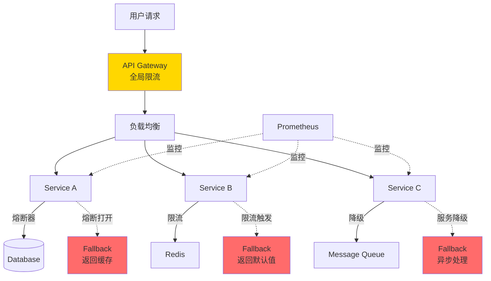
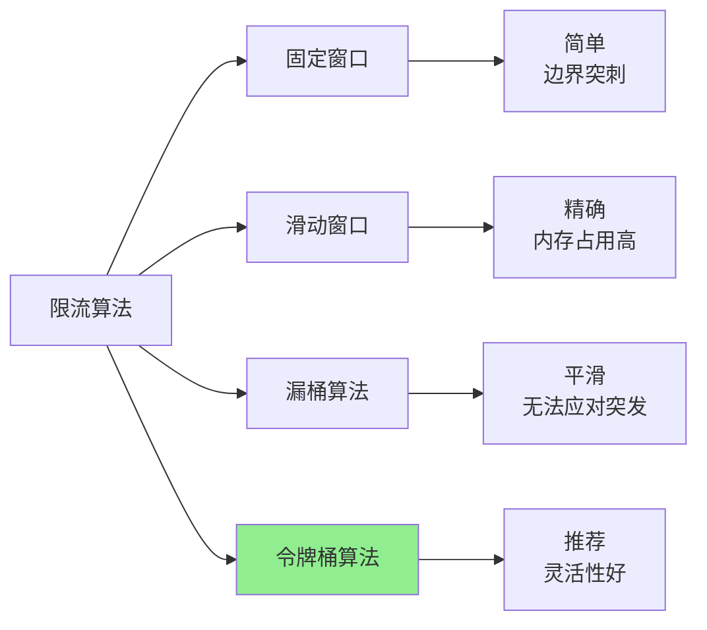
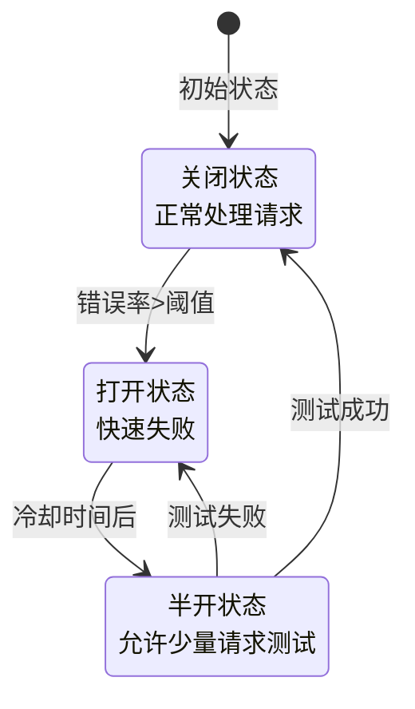
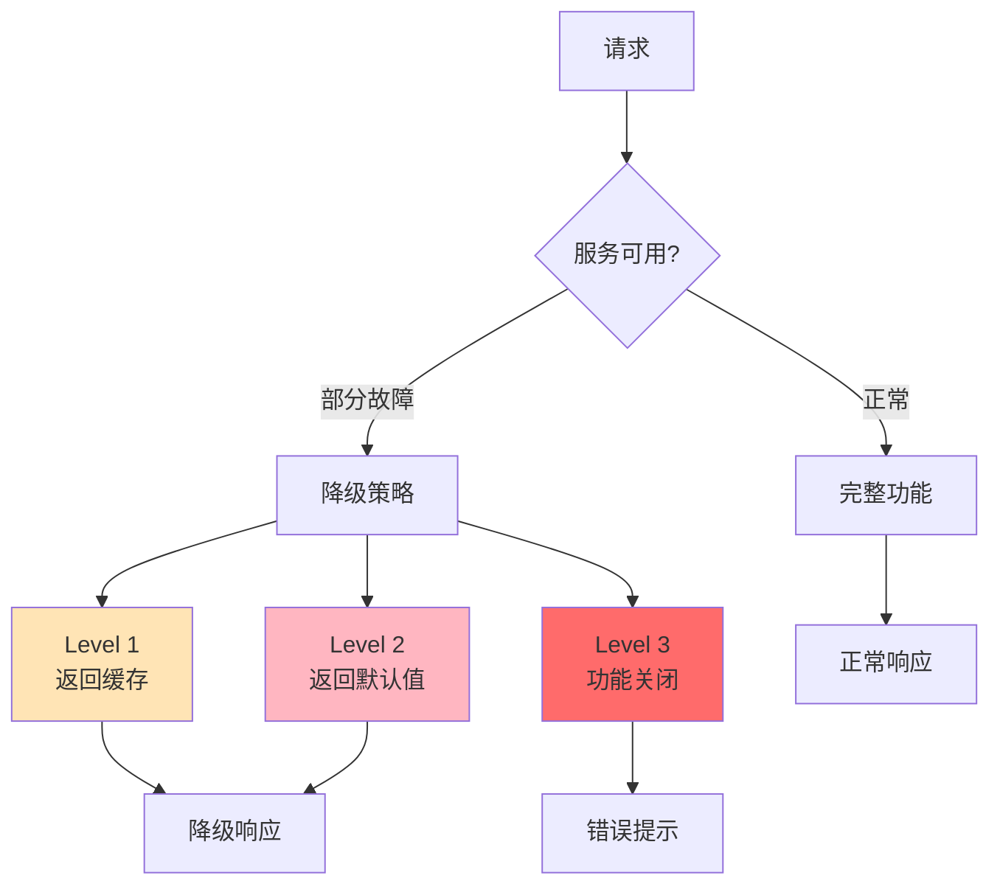

# 流量治理拓扑：限流熔断规则与降级策略

## 流量治理全景架构



## 1. 限流策略 (Rate Limiting)

### 限流算法对比



### 方案A: Sentinel限流规则

#### Spring Boot集成

```xml
<!-- pom.xml -->
<dependency>
    <groupId>com.alibaba.cloud</groupId>
    <artifactId>spring-cloud-starter-alibaba-sentinel</artifactId>
    <version>2022.0.0.0</version>
</dependency>
```

```java
// SentinelConfig.java
@Configuration
public class SentinelConfig {

    @PostConstruct
    public void initFlowRules() {
        List<FlowRule> rules = new ArrayList<>();

        // 规则1: QPS限流
        FlowRule rule1 = new FlowRule();
        rule1.setResource("getUserInfo");
        rule1.setGrade(RuleConstant.FLOW_GRADE_QPS);
        rule1.setCount(100);  // 每秒100请求
        rule1.setStrategy(RuleConstant.STRATEGY_DIRECT);
        rule1.setControlBehavior(RuleConstant.CONTROL_BEHAVIOR_DEFAULT);
        rules.add(rule1);

        // 规则2: 热点参数限流
        FlowRule rule2 = new FlowRule();
        rule2.setResource("getProduct");
        rule2.setGrade(RuleConstant.FLOW_GRADE_QPS);
        rule2.setCount(50);
        rule2.setParamIdx(0);  // 对第一个参数限流
        rules.add(rule2);

        // 规则3: 关联限流
        FlowRule rule3 = new FlowRule();
        rule3.setResource("writeOrder");
        rule3.setGrade(RuleConstant.FLOW_GRADE_QPS);
        rule3.setCount(200);
        rule3.setStrategy(RuleConstant.STRATEGY_RELATE);
        rule3.setRefResource("queryOrder");  // 写操作优先级高于读
        rules.add(rule3);

        FlowRuleManager.loadRules(rules);
    }
}
```

```java
// UserController.java
@RestController
@RequestMapping("/api/users")
public class UserController {

    @GetMapping("/{id}")
    @SentinelResource(
        value = "getUserInfo",
        blockHandler = "handleBlock",
        fallback = "handleFallback"
    )
    public ResponseEntity<User> getUser(@PathVariable Long id) {
        return ResponseEntity.ok(userService.getById(id));
    }

    // 限流触发
    public ResponseEntity<User> handleBlock(Long id, BlockException ex) {
        return ResponseEntity
            .status(429)  // Too Many Requests
            .body(null);
    }

    // 业务异常降级
    public ResponseEntity<User> handleFallback(Long id, Throwable ex) {
        // 返回缓存数据
        User cachedUser = cacheService.getUser(id);
        return ResponseEntity.ok(cachedUser);
    }
}
```

#### 动态规则配置(Nacos集成)

```yaml
# application.yml
spring:
  cloud:
    sentinel:
      datasource:
        ds1:
          nacos:
            server-addr: localhost:8848
            dataId: sentinel-flow-rules
            groupId: SENTINEL_GROUP
            data-type: json
            rule-type: flow
```

```json
// Nacos配置: sentinel-flow-rules
[
  {
    "resource": "getUserInfo",
    "grade": 1,
    "count": 100,
    "strategy": 0,
    "controlBehavior": 0,
    "clusterMode": false
  },
  {
    "resource": "getProduct",
    "grade": 1,
    "count": 50,
    "paramIdx": 0,
    "paramFlowItemList": [
      {
        "object": "hot_product_id",
        "count": 10,
        "classType": "java.lang.String"
      }
    ]
  }
]
```

### 方案B: Nginx限流

```nginx
# nginx.conf
http {
    # 限流区域定义
    # 每个IP 10MB内存空间,每秒10个请求
    limit_req_zone $binary_remote_addr zone=api_limit:10m rate=10r/s;

    # 按API Key限流
    limit_req_zone $http_x_api_key zone=key_limit:10m rate=100r/s;

    # 连接数限制
    limit_conn_zone $binary_remote_addr zone=conn_limit:10m;

    server {
        listen 80;

        location /api/ {
            # 限流配置
            limit_req zone=api_limit burst=20 nodelay;
            limit_req zone=key_limit burst=50;
            limit_conn conn_limit 10;

            # 限流响应
            limit_req_status 429;
            limit_conn_status 429;

            proxy_pass http://backend;
        }

        # 静态资源不限流
        location /static/ {
            alias /var/www/static/;
        }
    }
}
```

### 方案C: Redis + Lua分布式限流

```lua
-- redis-rate-limiter.lua
local key = KEYS[1]
local limit = tonumber(ARGV[1])
local window = tonumber(ARGV[2])

local current = redis.call('GET', key)
if current and tonumber(current) >= limit then
    return 0  -- 限流
end

redis.call('INCR', key)
redis.call('EXPIRE', key, window)
return 1  -- 允许通过
```

```java
// RateLimiter.java
@Component
public class RedisRateLimiter {

    @Autowired
    private RedisTemplate<String, String> redisTemplate;

    private static final String LUA_SCRIPT = """
        local key = KEYS[1]
        local limit = tonumber(ARGV[1])
        local window = tonumber(ARGV[2])
        local current = redis.call('INCR', key)
        if current == 1 then
            redis.call('EXPIRE', key, window)
        end
        if current > limit then
            return 0
        end
        return 1
        """;

    public boolean allowRequest(String resource, int limit, int windowSeconds) {
        String key = "rate_limit:" + resource + ":" + getCurrentWindow(windowSeconds);

        DefaultRedisScript<Long> script = new DefaultRedisScript<>();
        script.setScriptText(LUA_SCRIPT);
        script.setResultType(Long.class);

        Long result = redisTemplate.execute(
            script,
            Collections.singletonList(key),
            String.valueOf(limit),
            String.valueOf(windowSeconds)
        );

        return result != null && result == 1;
    }

    private long getCurrentWindow(int windowSeconds) {
        return System.currentTimeMillis() / 1000 / windowSeconds;
    }
}
```

## 2. 熔断器 (Circuit Breaker)

### 熔断器状态机



### 方案A: Resilience4j实现

```java
// CircuitBreakerConfig.java
@Configuration
public class CircuitBreakerConfig {

    @Bean
    public CircuitBreaker paymentCircuitBreaker() {
        CircuitBreakerConfig config = CircuitBreakerConfig.custom()
            .failureRateThreshold(50)                    // 失败率>50%触发熔断
            .slowCallRateThreshold(50)                   // 慢调用率>50%触发
            .slowCallDurationThreshold(Duration.ofSeconds(2))
            .waitDurationInOpenState(Duration.ofSeconds(60))  // 熔断持续60秒
            .permittedNumberOfCallsInHalfOpenState(10)   // 半开状态允许10个测试请求
            .slidingWindowType(SlidingWindowType.COUNT_BASED)
            .slidingWindowSize(100)                      // 统计最近100个请求
            .minimumNumberOfCalls(10)                    // 最少10个请求才计算
            .automaticTransitionFromOpenToHalfOpenEnabled(true)
            .recordExceptions(IOException.class, TimeoutException.class)
            .ignoreExceptions(BusinessException.class)
            .build();

        return CircuitBreaker.of("payment-service", config);
    }
}
```

```java
// PaymentService.java
@Service
public class PaymentService {

    @Autowired
    private CircuitBreaker circuitBreaker;

    public PaymentResult processPayment(Order order) {
        // 装饰业务方法
        Supplier<PaymentResult> decoratedSupplier = CircuitBreaker
            .decorateSupplier(circuitBreaker, () -> callPaymentGateway(order));

        // 添加fallback
        return Try.ofSupplier(decoratedSupplier)
            .recover(CallNotPermittedException.class, ex -> {
                // 熔断打开,使用降级逻辑
                return PaymentResult.deferred("支付服务繁忙,订单已记录");
            })
            .recover(TimeoutException.class, ex -> {
                // 超时降级
                return PaymentResult.deferred("支付处理中,请稍后查询");
            })
            .get();
    }

    private PaymentResult callPaymentGateway(Order order) {
        // 实际调用支付网关
        return paymentGateway.charge(order.getAmount());
    }
}
```

### 熔断器监控

```java
// CircuitBreakerMetrics.java
@Component
public class CircuitBreakerMetrics {

    @Autowired
    private CircuitBreakerRegistry circuitBreakerRegistry;

    @Scheduled(fixedRate = 10000)
    public void recordMetrics() {
        circuitBreakerRegistry.getAllCircuitBreakers().forEach(cb -> {
            CircuitBreaker.Metrics metrics = cb.getMetrics();

            logger.info("CircuitBreaker: {} - State: {}, " +
                "FailureRate: {:.2f}%, " +
                "SlowCallRate: {:.2f}%, " +
                "BufferedCalls: {}",
                cb.getName(),
                cb.getState(),
                metrics.getFailureRate(),
                metrics.getSlowCallRate(),
                metrics.getNumberOfBufferedCalls()
            );
        });
    }
}
```

## 3. 降级策略 (Fallback & Degradation)

### 降级层次架构



### 降级实现示例

```java
// ProductService.java
@Service
public class ProductService {

    @Autowired
    private ProductRepository productRepo;

    @Autowired
    private RedisTemplate<String, Product> redisTemplate;

    @Autowired
    private FeatureToggleService featureToggle;

    public ProductDetail getProductDetail(Long productId) {
        // 检查是否需要降级
        if (featureToggle.isEnabled("product.detail.degradation")) {
            return getDegradedProductDetail(productId);
        }

        try {
            // 正常流程
            return getFullProductDetail(productId);

        } catch (DatabaseException ex) {
            // Level 1: 数据库故障,使用缓存
            logger.warn("Database failure, using cache", ex);
            return getProductFromCache(productId);

        } catch (Exception ex) {
            // Level 2: 完全降级
            logger.error("Complete degradation", ex);
            return getMinimalProductDetail(productId);
        }
    }

    private ProductDetail getFullProductDetail(Long productId) {
        Product product = productRepo.findById(productId);
        Reviews reviews = reviewService.getReviews(productId);      // 可能慢
        Recommendations recs = recommendService.getRelated(productId); // 可能慢

        return ProductDetail.builder()
            .product(product)
            .reviews(reviews)
            .recommendations(recs)
            .build();
    }

    private ProductDetail getDegradedProductDetail(Long productId) {
        // 降级: 不查询评论和推荐
        Product product = productRepo.findById(productId);

        return ProductDetail.builder()
            .product(product)
            .reviews(Reviews.empty())
            .recommendations(Recommendations.empty())
            .build();
    }

    private ProductDetail getProductFromCache(Long productId) {
        String key = "product:" + productId;
        Product cached = redisTemplate.opsForValue().get(key);

        if (cached == null) {
            return getMinimalProductDetail(productId);
        }

        return ProductDetail.fromCache(cached);
    }

    private ProductDetail getMinimalProductDetail(Long productId) {
        // 最小化响应
        return ProductDetail.builder()
            .productId(productId)
            .message("商品信息暂时无法获取")
            .build();
    }
}
```

### 功能开关 (Feature Toggle)

```java
// FeatureToggleService.java
@Service
public class FeatureToggleService {

    @Autowired
    private RedisTemplate<String, String> redisTemplate;

    private static final String FEATURE_KEY_PREFIX = "feature:toggle:";

    public boolean isEnabled(String featureName) {
        String key = FEATURE_KEY_PREFIX + featureName;
        String value = redisTemplate.opsForValue().get(key);
        return "true".equals(value);
    }

    public void enable(String featureName) {
        String key = FEATURE_KEY_PREFIX + featureName;
        redisTemplate.opsForValue().set(key, "true");
    }

    public void disable(String featureName) {
        String key = FEATURE_KEY_PREFIX + featureName;
        redisTemplate.opsForValue().set(key, "false");
    }

    // 百分比灰度
    public boolean isEnabledForUser(String featureName, String userId) {
        if (!isEnabled(featureName)) {
            return false;
        }

        String percentKey = FEATURE_KEY_PREFIX + featureName + ":percent";
        String percent = redisTemplate.opsForValue().get(percentKey);

        if (percent == null) {
            return true;
        }

        int threshold = Integer.parseInt(percent);
        int hash = Math.abs(userId.hashCode() % 100);
        return hash < threshold;
    }
}
```

## 4. 完整流量治理配置

### Sentinel Dashboard配置

```yaml
# sentinel-dashboard配置导出
[
  {
    "resource": "/api/orders",
    "limitApp": "default",
    "grade": 1,
    "count": 100,
    "strategy": 0,
    "controlBehavior": 0,
    "clusterMode": false
  },
  {
    "resource": "orderService",
    "grade": 0,
    "count": 50,
    "timeWindow": 10,
    "minRequestAmount": 5,
    "statIntervalMs": 1000,
    "slowRatioThreshold": 0.5
  }
]
```

### Prometheus告警规则

```yaml
# prometheus-alerts.yml
groups:
  - name: traffic-governance
    rules:
      # 限流告警
      - alert: HighRateLimitRejects
        expr: |
          rate(sentinel_block_qps_total[5m]) > 100
        for: 5m
        labels:
          severity: warning
        annotations:
          summary: "大量请求被限流"

      # 熔断告警
      - alert: CircuitBreakerOpen
        expr: |
          resilience4j_circuitbreaker_state{state="open"} == 1
        for: 1m
        labels:
          severity: critical
        annotations:
          summary: "熔断器打开: {{ $labels.name }}"

      # 降级告警
      - alert: ServiceDegraded
        expr: |
          rate(service_degradation_total[5m]) > 0
        labels:
          severity: warning
        annotations:
          summary: "服务降级中: {{ $labels.service }}"
```

## 5. 实战案例

### 案例: 电商秒杀场景

**挑战**:
- 瞬时流量从100 QPS飙升至10万 QPS
- 库存服务承压巨大
- 需保护核心下单链路

**解决方案**:

```mermaid
graph TB
    U[用户] --> CDN[CDN静态页面]
    CDN --> GW[API Gateway<br/>全局限流5000 QPS]

    GW --> Q[消息队列<br/>削峰填谷]
    Q --> S[秒杀服务<br/>熔断保护]

    S --> INV[库存服务<br/>预扣库存]
    S --> CACHE[Redis<br/>库存缓存]

    S -.熔断打开.-> FB[Fallback<br/>返回"已售罄"]

    style GW fill:#FFD700
    style Q fill:#87CEEB
    style FB fill:#FF6B6B
```

**关键配置**:

```java
@Configuration
public class SeckillConfig {

    // 1. API Gateway限流
    @Bean
    public RateLimiter gatewayLimiter() {
        return RateLimiter.of("gateway", RateLimiterConfig.custom()
            .limitForPeriod(5000)        // 每秒5000请求
            .limitRefreshPeriod(Duration.ofSeconds(1))
            .timeoutDuration(Duration.ofMillis(100))
            .build());
    }

    // 2. 库存服务熔断
    @Bean
    public CircuitBreaker inventoryCircuitBreaker() {
        return CircuitBreaker.of("inventory", CircuitBreakerConfig.custom()
            .failureRateThreshold(30)    // 30%失败率
            .waitDurationInOpenState(Duration.ofSeconds(5))
            .slidingWindowSize(100)
            .build());
    }

    // 3. 秒杀服务降级
    @Bean
    public Bulkhead seckillBulkhead() {
        return Bulkhead.of("seckill", BulkheadConfig.custom()
            .maxConcurrentCalls(1000)    // 最大并发1000
            .maxWaitDuration(Duration.ofMillis(500))
            .build());
    }
}
```

**效果**:
- 系统整体QPS稳定在5000
- 库存服务熔断3次,避免雪崩
- 用户体验良好(快速返回结果)
- 无服务器宕机

---

## 总结

### 流量治理最佳实践

| 策略 | 适用场景 | 关键指标 |
|------|---------|---------|
| **限流** | 保护系统资源 | QPS, 并发数 |
| **熔断** | 防止级联故障 | 错误率, 响应时间 |
| **降级** | 保障核心功能 | 可用性, 用户体验 |

### 实施Checklist

```markdown
- [ ] 识别系统瓶颈和保护目标
- [ ] 制定限流阈值(基于压测结果)
- [ ] 配置熔断规则(错误率/超时)
- [ ] 实现多级降级策略
- [ ] 部署监控告警
- [ ] 准备应急预案
- [ ] 演练故障场景
```

---

**文档版本**: v1.0
**最后更新**: 2025-11-13
