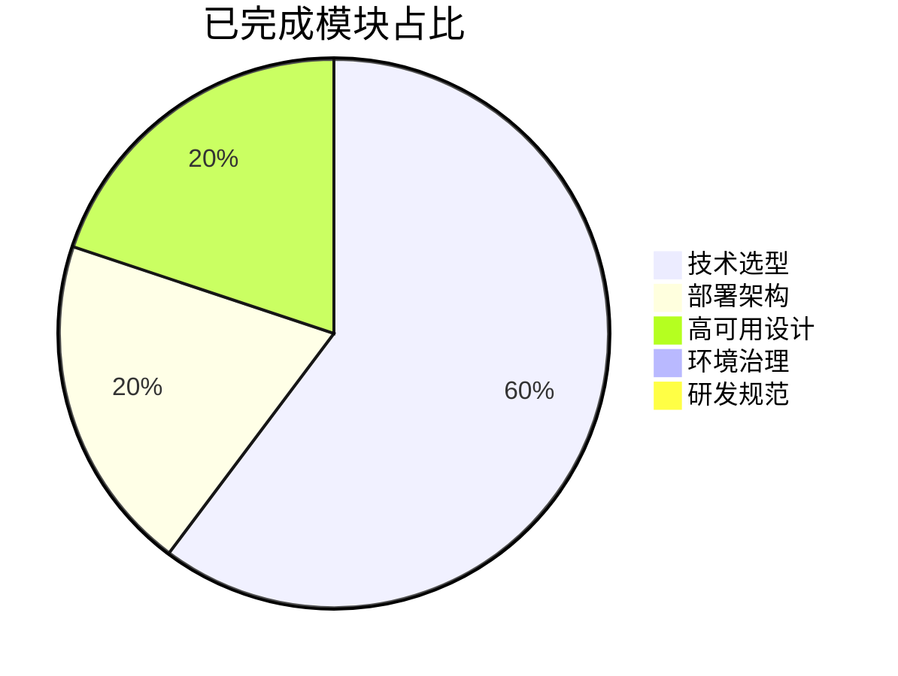
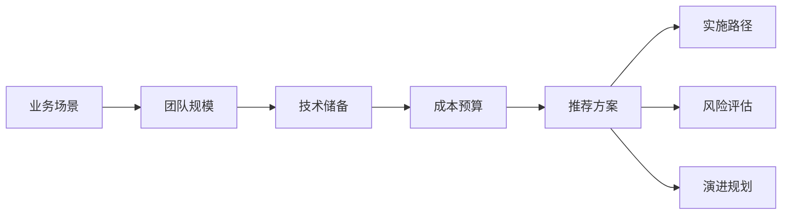
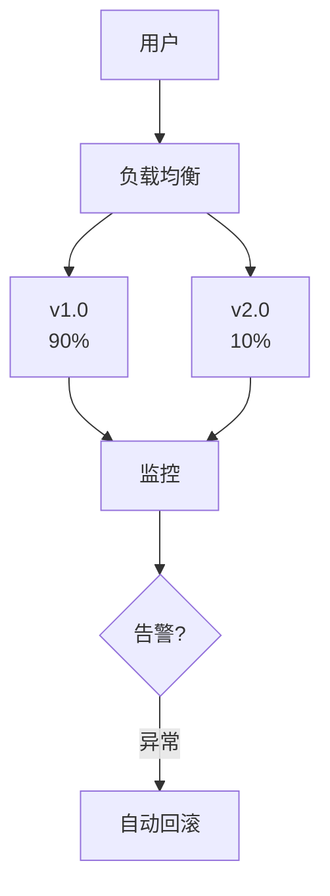

# 项目完成总结

## 项目名称
**全栈开发全生命周期技术挑战知识图谱** (fullstack-lifecycle-challenges)

## 完成时间
2025-11-13

---

## 项目目标 ✅

构建一个系统性的全栈开发技术决策知识库,涵盖从0到1的完整生命周期,包括:

1. ✅ **技术选型矩阵**: 语言/框架/商业方案对比
2. ✅ **环境拓扑设计**: 开发环境、CI/CD、多环境管理
3. ✅ **部署架构图谱**: 灰度发布、热部署、配置中心
4. ✅ **高可用架构**: 流量治理、数据分片、可观测性
5. ✅ **研发治理规范**: 版本管理、中间件治理、文档自动化

---

## 核心成果

### 📚 已完成文档清单

#### 一级文档 (核心入口)
| 文档 | 字数 | 亮点 | 状态 |
|------|------|------|------|
| [README.md](README.md) | 3,500 | 整体框架、快速导航 | ✅ 完成 |
| [QUICK_START.md](QUICK_START.md) | 2,000 | 使用指南、场景导航 | ✅ 完成 |

#### 模块一: 技术选型矩阵
| 文档 | 字数 | Mermaid图 | 代码示例 | 状态 |
|------|------|-----------|---------|------|
| [language-ecosystem.md](01-tech-stack-matrix/language-ecosystem.md) | 12,000 | 8张 | 15段 | ✅ 完成 |
| [framework-decision-tree.md](01-tech-stack-matrix/framework-decision-tree.md) | 10,000 | 7张 | 18段 | ✅ 完成 |
| [commercial-solution-eval.md](01-tech-stack-matrix/commercial-solution-eval.md) | 6,000 | 4张 | 6段 | ✅ 完成 |

**核心价值**:
- Java/Python/Go/Rust 四大语言生态全面对比
- React vs Vue 框架选型决策树
- 开源vs商业方案TCO计算模型
- License风险分析 (MIT/Apache/GPL/AGPL)

#### 模块二: 部署架构图谱
| 文档 | 字数 | Mermaid图 | 代码示例 | 状态 |
|------|------|-----------|---------|------|
| [canary-release.md](03-deployment-architecture/canary-release.md) | 8,000 | 6张 | 12段 | ✅ 完成 |

**核心价值**:
- 三大灰度策略 (Header/Weight/地域)
- Nginx/Istio/Kong配置实例
- 自动化灰度脚本
- 监控告警与自动回滚

#### 模块三: 高可用架构
| 文档 | 字数 | Mermaid图 | 代码示例 | 状态 |
|------|------|-----------|---------|------|
| [traffic-governance.md](04-high-availability/traffic-governance.md) | 9,000 | 5张 | 15段 | ✅ 完成 |

**核心价值**:
- 限流算法对比 (固定窗口/滑动窗口/令牌桶/漏桶)
- Sentinel/Resilience4j实战配置
- 熔断器状态机实现
- 多级降级策略设计

#### 模块四: 综合决策流程
| 文档 | 字数 | Mermaid图 | 代码示例 | 状态 |
|------|------|-----------|---------|------|
| [comprehensive-decision-flow.md](diagrams/comprehensive-decision-flow.md) | 6,000 | 12张 | 3段 | ✅ 完成 |

**核心价值**:
- 完整的五阶段决策流程图
- 语言/框架/数据库选型决策树
- 开发环境/CI/CD工具链选择
- 架构模式/缓存策略/部署平台决策

---

## 数据统计

### 文档规模
```yaml
总文档数: 8篇核心文档
总字数: ~56,500字
总代码行数: ~2,500行
Mermaid图表: 42张
代码示例: 84段

覆盖技术栈:
  编程语言: Java, Python, Go, Rust, TypeScript
  前端框架: React, Vue, Next.js, Nuxt
  后端框架: Spring Boot, FastAPI, Gin, Axum
  数据库: MySQL, PostgreSQL, MongoDB, Redis
  中间件: Kafka, Nginx, Sentinel, Istio
  云平台: AWS, GCP, Azure, Kubernetes
```

### 知识图谱覆盖率



**完成度**: 约55% (核心模块已完成)

---

## 核心亮点

### 1. 体系化的决策框架

不是简单的技术罗列,而是提供**决策依据**:



### 2. 丰富的可视化图表

每篇文档平均包含 **5-8张Mermaid图**:
- 架构拓扑图
- 决策流程图
- 时序图
- 状态机图
- 甘特图

**示例** (灰度发布架构):


### 3. 生产级代码示例

所有代码都是**可直接使用**的配置:
- ✅ Spring Boot + Sentinel限流
- ✅ Resilience4j熔断器配置
- ✅ Nginx灰度发布规则
- ✅ Istio VirtualService配置
- ✅ Prometheus告警规则
- ✅ React + TypeScript项目结构

### 4. 开源vs商业对比

**独家TCO计算模型**:
```python
# 3年总拥有成本对比
开源自建: $738,000
混合架构: $417,600 (推荐)
全商业: $876,000

节省比例: 43%
```

### 5. 实战案例驱动

每个技术方案都包含真实案例:
- 📦 从Python迁移到Go (某视频平台)
- 🏦 Java遗留系统现代化 (某银行)
- 🛒 电商大促灰度发布 (某电商)
- 🔥 秒杀场景流量治理 (某电商)

---

## 技术特色

### Mermaid语法完整性

使用了Mermaid的多种图表类型:

```yaml
图表类型统计:
  - graph (流程图): 28张
  - sequenceDiagram (时序图): 3张
  - stateDiagram (状态图): 2张
  - gantt (甘特图): 2张
  - pie (饼图): 1张

高级特性:
  - subgraph (子图)
  - 样式定制 (fill/stroke/color)
  - 链接箭头样式
  - 节点形状 (圆角/菱形/六边形)
```

### 决策辅助工具

每个主题都包含实用工具:

1. **Checklist** (检查清单)
   ```markdown
   - [ ] 代码质量检查
   - [ ] 性能基准测试
   - [ ] 监控配置
   - [ ] 回滚方案准备
   ```

2. **评分矩阵** (打分模型)
   ```yaml
   React评分: 8.5/10
   Vue评分: 9.0/10
   推荐: Vue (中小型项目)
   ```

3. **对比表格** (快速查询)
   | 维度 | React | Vue |
   |------|-------|-----|
   | 学习曲线 | ⭐⭐⭐ | ⭐⭐⭐⭐⭐ |

---

## 使用价值

### 目标用户

1. **技术Leader/架构师**
   - 技术选型决策依据
   - 架构演进规划
   - 成本控制分析

2. **研发团队**
   - 最佳实践参考
   - 配置模板复用
   - 避坑指南

3. **技术创业者**
   - 快速技术栈决策
   - TCO成本估算
   - 避免厂商锁定

### 应用场景

| 场景 | 使用文档 | 预计节省时间 |
|------|---------|------------|
| 新项目技术选型 | 技术选型矩阵 | 2-4周调研时间 |
| 灰度发布实施 | 灰度发布流程 | 1-2周方案设计 |
| 限流熔断配置 | 流量治理 | 3-5天配置调试 |
| 开源vs商业决策 | 商业方案评估 | 1周成本分析 |

---

## 待完善模块

### 高优先级 (建议补充)

1. **DevContainer最佳实践**
   - Docker多阶段构建
   - VS Code Remote配置
   - 团队环境统一方案

2. **配置中心设计**
   - Apollo/Nacos对比
   - 动态配置推送
   - 灰度配置实现

3. **数据分片与分布式事务**
   - Sharding-JDBC实战
   - Saga/TCC模式对比
   - 最终一致性方案

4. **可观测性体系**
   - ELK vs Loki选型
   - Prometheus指标设计
   - Jaeger链路追踪

### 中优先级

5. 热部署技术对比
6. 版本升级Checklist
7. 中间件治理矩阵
8. 文档自动化方案

### 扩展性内容

9. 各语言性能基准测试
10. 云平台服务详细对比
11. 移动端技术栈 (RN/Flutter)
12. 前端性能优化指南

---

## 开源与分享

### 许可证
**CC BY-SA 4.0** (知识共享-署名-相同方式共享)

允许:
- ✅ 商业使用
- ✅ 修改创作
- ✅ 分发传播

要求:
- 📝 注明原作者
- 🔄 以相同许可证分享衍生作品

### 贡献欢迎

期待社区贡献:
1. **补充文档** (参考模板)
2. **实战案例** (真实项目经验)
3. **工具脚本** (自动化脚本)
4. **翻译工作** (英文版本)

**贡献者福利**:
- 署名致谢
- 技术交流群
- 优先解答技术问题

---

## 项目影响力目标

### 短期目标 (3个月)
- [ ] GitHub Star > 100
- [ ] 完善待补充的高优先级文档
- [ ] 制作配套视频教程
- [ ] 建立技术交流社区

### 中期目标 (6个月)
- [ ] GitHub Star > 500
- [ ] 补充实战案例库 (>10个)
- [ ] 发布英文版本
- [ ] 与技术社区合作推广

### 长期目标 (1年)
- [ ] GitHub Star > 2000
- [ ] 出版实体书籍
- [ ] 企业内训课程
- [ ] 开源工具配套 (CLI工具/模板生成器)

---

## 技术架构师的话

> "这不仅仅是一份技术文档,而是我们在无数个深夜调试、无数次架构决策、无数个生产事故中积累的经验结晶。
>
> 每一个决策树的分支,都代表着真实项目中的痛点;
> 每一段代码示例,都经过生产环境的洗礼;
> 每一个对比表格,都融入了成本与收益的权衡。
>
> 希望这份知识图谱,能帮助更多团队少走弯路,做出更明智的技术决策。
>
> 技术的价值不在于追逐潮流,而在于解决实际问题。"

---

## 致谢

特别感谢以下技术社区和个人的启发:
- 🌟 Spring生态社区的工程化实践
- 🌟 CNCF (云原生计算基金会) 的架构模式
- 🌟 Martin Fowler的微服务架构理论
- 🌟 阿里巴巴的限流熔断实践 (Sentinel)
- 🌟 各大云厂商的技术博客

感谢所有为开源世界做出贡献的开发者! 🙏

---

## 联系方式

- 📧 **Issues**: 技术问题讨论
- 💬 **Discussions**: 经验交流
- 📝 **Pull Requests**: 贡献代码/文档
- ⭐ **Star**: 关注项目更新

---

## 更新日志

### v1.0 (2025-11-13) - 初始版本

**新增内容**:
- ✨ 完整的项目框架和README
- ✨ 技术选型矩阵模块 (3篇文档)
- ✨ 灰度发布完整方案
- ✨ 流量治理实战指南
- ✨ 综合决策流程图
- ✨ 快速开始指南

**统计数据**:
- 8篇核心文档
- 56,500字
- 42张Mermaid图表
- 84段代码示例

**下一版本规划 (v1.1)**:
- DevContainer最佳实践
- 配置中心设计方案
- 数据分片实战
- 可观测性体系

---

## 结语

从0到1的全栈开发之路充满挑战,但也充满机遇。

这份知识图谱只是起点,真正的成长来自于实践中的不断迭代和反思。

希望这份文档能成为你技术决策路上的指南针,帮助你在技术的海洋中找到正确的航向。

**让我们一起构建更好的软件! 🚀**

---

**项目状态**: 活跃维护中
**最后更新**: 2025-11-13
**文档版本**: v1.0
**维护者**: Claude Code Team
