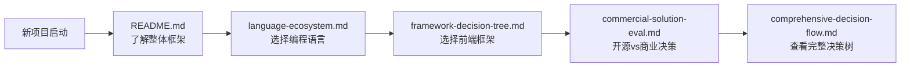
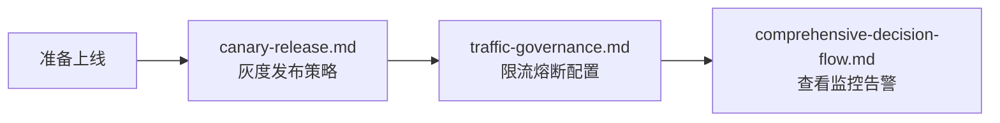
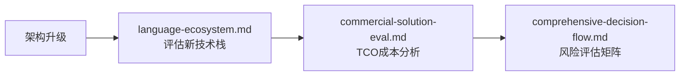

# 快速开始指南 (Quick Start)

> 5分钟了解如何使用本知识图谱

## 目录导航

```
fullstack-lifecycle-challenges/
├── README.md                          ⭐ 从这里开始
├── QUICK_START.md                     📖 本文件
│
├── 01-tech-stack-matrix/              🎯 技术选型阶段
│   ├── language-ecosystem.md          语言生态对比 (Java/Python/Go/Rust)
│   ├── framework-decision-tree.md     前端框架选型 (React/Vue)
│   └── commercial-solution-eval.md    开源vs商业方案评估
│
├── 02-environment-topology/           🛠️ 环境搭建阶段
│   ├── devcontainer-practices.md      [待补充] Docker开发环境
│   ├── multi-env-strategy.md          [待补充] 多环境管理
│   └── toolchain-integration.md       [待补充] CI/CD工具链
│
├── 03-deployment-architecture/        🚀 部署上线阶段
│   ├── canary-release.md              灰度发布完整方案
│   ├── hot-deployment.md              [待补充] 热部署技术
│   └── config-center-design.md        [待补充] 配置中心设计
│
├── 04-high-availability/              💪 高可用架构
│   ├── traffic-governance.md          流量治理(限流/熔断/降级)
│   ├── data-layer-design.md           [待补充] 数据分片方案
│   └── observability-system.md        [待补充] 可观测性体系
│
├── 05-dev-governance/                 📋 研发规范
│   ├── version-upgrade-checklist.md   [待补充] 版本升级
│   ├── middleware-governance.md       [待补充] 中间件治理
│   └── doc-automation.md              [待补充] 文档自动化
│
└── diagrams/                          🗺️ 综合决策图
    ├── comprehensive-decision-flow.md  完整决策流程图
    └── technology-evolution-roadmap.md [待补充] 演进路线图
```

## 使用场景导航

### 场景1: 新项目技术选型



**推荐阅读顺序**:
1. [README.md](README.md) - 10分钟
2. [语言生态对比](01-tech-stack-matrix/language-ecosystem.md) - 20分钟
3. [框架决策树](01-tech-stack-matrix/framework-decision-tree.md) - 15分钟
4. [综合决策流程](diagrams/comprehensive-decision-flow.md) - 15分钟

**总耗时**: 约1小时

---

### 场景2: 准备生产发布



**推荐阅读顺序**:
1. [灰度发布流程](03-deployment-architecture/canary-release.md) - 30分钟
2. [流量治理](04-high-availability/traffic-governance.md) - 30分钟

**输出成果**:
- ✅ 灰度发布Checklist
- ✅ Sentinel/Nginx限流配置
- ✅ 监控告警规则

---

### 场景3: 架构升级决策



**关键决策工具**:
- TCO计算器 (见商业方案评估文档)
- 风险评估矩阵
- 迁移成本估算表

---

## 核心亮点

### 🎨 丰富的Mermaid架构图

每个文档包含大量可视化图表:
- 技术选型决策树
- 架构拓扑图
- 流程时序图
- 状态机图

示例:


### 📊 实战代码示例

包含生产级配置示例:
- Spring Boot + Sentinel限流
- React + TypeScript项目结构
- Nginx灰度发布配置
- Prometheus监控规则

### ⚖️ 开源vs商业对比

详细的方案对比表:
- License风险分析
- TCO成本计算
- 厂商锁定评估
- 迁移难度估算

### 🎯 快速决策指南

每个主题都有"1分钟快速决策"章节:
```markdown
## 选择React如果:
- ✅ 需要移动端APP (React Native)
- ✅ 团队已有React经验
- ✅ 大型项目,需要严格规范

## 选择Vue如果:
- ✅ 中小型项目
- ✅ 需要快速上手
- ✅ 团队有传统Web背景
```

---

## 贡献指南

### 待补充的文档

当前已完成核心文档,以下文档欢迎贡献:

**高优先级**:
- [ ] DevContainer最佳实践
- [ ] 多环境管理策略
- [ ] 配置中心设计方案
- [ ] 数据分片与分布式事务

**中优先级**:
- [ ] 热部署技术对比
- [ ] 可观测性体系搭建
- [ ] 版本升级Checklist
- [ ] 中间件治理矩阵

**扩展性文档**:
- [ ] 各语言性能基准测试
- [ ] 云平台服务对比 (AWS/GCP/Azure)
- [ ] 移动端技术栈 (React Native/Flutter)
- [ ] 前端性能优化指南

### 贡献方式

1. **Fork本仓库**
2. **选择待补充的主题**
3. **参考现有文档格式**:
   - 使用Mermaid绘制架构图
   - 包含代码示例
   - 提供决策Checklist
   - 添加实战案例
4. **提交Pull Request**

**文档模板**:
```markdown
# 文档标题

## 概览架构图
[Mermaid图表]

## 1. 核心概念

## 2. 技术方案对比

## 3. 实现示例

## 4. 最佳实践

## 5. 避坑指南

---
**文档版本**: v1.0
**最后更新**: YYYY-MM-DD
```

---

## 实用工具

### 在线Mermaid编辑器

推荐工具:
- [Mermaid Live Editor](https://mermaid.live/)
- [VS Code Mermaid插件](https://marketplace.visualstudio.com/items?itemName=bierner.markdown-mermaid)

### 本地预览

```bash
# 安装Markdown预览工具
npm install -g markdown-it

# 预览文档
markdown-it README.md > preview.html
```

### 导出PDF

```bash
# 使用pandoc导出
pandoc README.md -o fullstack-guide.pdf

# 或使用浏览器打印功能
# Chrome → 打开Markdown → 右键打印 → 另存为PDF
```

---

## 反馈与支持

### 常见问题

**Q: 文档太长,如何快速找到需要的内容?**
A: 使用Ctrl+F搜索关键词,或查看README中的"快速导航"章节

**Q: 某些技术栈没有覆盖怎么办?**
A: 欢迎提Issue或贡献文档!

**Q: 如何获取最新版本?**
A: Star本仓库,开启Watch获取更新通知

### 联系方式

- 📧 提Issue: [GitHub Issues](#)
- 💬 讨论: [GitHub Discussions](#)
- 📝 贡献: 参考上方贡献指南

---

## 版本历史

### v1.0 (2025-11-13)

**已完成模块**:
- ✅ 整体框架和README
- ✅ 技术选型矩阵 (3篇)
- ✅ 灰度发布完整方案
- ✅ 流量治理实践
- ✅ 综合决策流程图

**文档统计**:
- 总文档数: 7篇核心文档
- 总字数: ~50,000字
- Mermaid图表: 30+ 张
- 代码示例: 50+ 段

**下一步计划**:
1. 补充环境拓扑设计模块
2. 完善可观测性体系
3. 添加实战案例库
4. 制作视频教程

---

## 致谢

本知识图谱汇集了以下技术社区的最佳实践:
- Spring生态社区
- React/Vue官方文档
- Kubernetes社区
- Cloud Native Computing Foundation (CNCF)
- 各大云厂商技术博客

感谢所有开源贡献者! 🙏

---

**现在就开始**: [返回README](README.md) 或 [查看技术选型](01-tech-stack-matrix/language-ecosystem.md)
