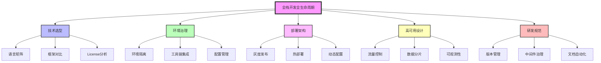
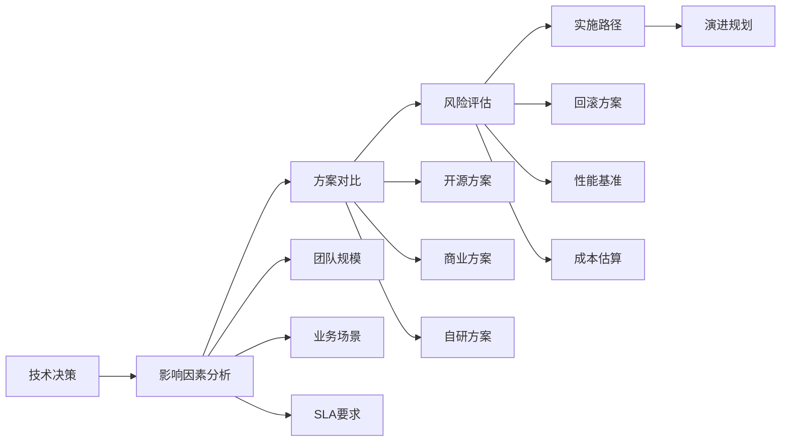

# 全栈开发全生命周期技术挑战知识图谱

> 从0到1构建企业级全栈应用的系统性技术决策指南

## 项目概述

本项目系统性地梳理全栈开发全生命周期中可能面临的技术挑战，为技术选型、架构设计、部署运维提供决策依据。通过Mermaid图谱和详细分析，帮助开发团队建立完整的技术认知体系。

## 核心架构图谱



## 知识图谱结构

### 📁 项目目录

```
fullstack-lifecycle-challenges/
├── README.md                          # 项目总览
├── 01-tech-stack-matrix/              # 技术选型矩阵
│   ├── language-ecosystem.md          # 语言生态对比
│   ├── framework-decision-tree.md     # 框架决策树
│   └── commercial-solution-eval.md    # 商业方案评估
├── 02-environment-topology/           # 环境拓扑设计
│   ├── devcontainer-practices.md      # DevContainer最佳实践
│   ├── multi-env-strategy.md          # 多环境管理策略
│   └── toolchain-integration.md       # 工具链集成
├── 03-deployment-architecture/        # 部署架构图谱
│   ├── canary-release.md              # 灰度发布流程
│   ├── hot-deployment.md              # 热部署技术方案
│   └── config-center-design.md        # 配置管理中心
├── 04-high-availability/              # 高可用架构要素
│   ├── traffic-governance.md          # 流量治理拓扑
│   ├── data-layer-design.md           # 数据层设计
│   └── observability-system.md        # 可观测性体系
├── 05-dev-governance/                 # 研发治理规范
│   ├── version-upgrade-checklist.md   # 版本升级checklist
│   ├── middleware-governance.md       # 中间件治理矩阵
│   └── doc-automation.md              # 文档自动化方案
└── diagrams/                          # Mermaid架构图集
    ├── comprehensive-decision-flow.md # 综合决策流程图
    └── technology-evolution-roadmap.md # 技术演进路线图
```

## 快速导航

### 🎯 按场景查找

- **初创团队（<10人）** → [轻量级技术栈推荐](01-tech-stack-matrix/language-ecosystem.md#startup-stack)
- **中型团队（10-50人）** → [标准化工程体系](02-environment-topology/toolchain-integration.md)
- **大型企业（>50人）** → [分布式架构方案](04-high-availability/)

### 🔍 按技术领域查找

- **前端技术** → [框架对比](01-tech-stack-matrix/framework-decision-tree.md#frontend)
- **后端技术** → [语言生态分析](01-tech-stack-matrix/language-ecosystem.md)
- **DevOps** → [环境治理](02-environment-topology/) + [部署架构](03-deployment-architecture/)
- **微服务治理** → [高可用设计](04-high-availability/)

### ⚡ 常见问题快速索引

1. **如何选择编程语言？** → [语言矩阵](01-tech-stack-matrix/language-ecosystem.md)
2. **Docker开发环境配置？** → [DevContainer实践](02-environment-topology/devcontainer-practices.md)
3. **如何实现灰度发布？** → [灰度发布流程](03-deployment-architecture/canary-release.md)
4. **分布式事务怎么处理？** → [数据层设计](04-high-availability/data-layer-design.md)
5. **中间件版本如何管理？** → [中间件治理](05-dev-governance/middleware-governance.md)

## 使用指南

### 决策模型

每个技术节点遵循统一的分析框架：



### 标注规范

所有技术方案文档包含以下标准字段：

| 字段 | 说明 | 示例 |
|------|------|------|
| **决策影响因素** | 选择该方案的关键驱动力 | 团队熟悉度、社区活跃度、招聘难度 |
| **典型实施方案** | 具体的技术组合 | React + Spring Boot + MySQL |
| **开源/商业对比** | 成本与能力对比 | Nacos(开源) vs Consul(商业) |
| **风险控制点** | 潜在问题及缓解措施 | 配置中心宕机 → 本地缓存兜底 |
| **性能基准** | 关键指标参考值 | API响应<100ms, DB连接池<500 |
| **演进路线图** | 架构升级路径 | 单体→垂直拆分→微服务→ServiceMesh |

## 核心主题预览

### 1️⃣ 技术选型矩阵

深入对比主流技术栈在企业场景的适用性：

- **语言生态**：Java生态完整性 vs Go并发性能 vs Python开发效率
- **框架选择**：Spring Boot稳定性 vs FastAPI轻量级 vs Gin高性能
- **License风险**：AGPL传染性 vs Apache宽松性 vs 商业License限制

### 2️⃣ 环境拓扑设计

构建一致性开发环境：

- **DevContainer方案**：VS Code配置 + Docker镜像管理 + 插件同步
- **环境隔离策略**：Namespace隔离 + 配置加密 + 流量染色
- **工具链矩阵**：GitLab CI vs Jenkins vs GitHub Actions

### 3️⃣ 部署架构图谱

零停机发布与动态配置：

- **灰度发布**：基于Header路由 + 金丝雀部署 + A/B测试
- **热部署技术**：JVM HotSwap vs Python uwsgi reload
- **配置中心**：Apollo长连接推送 vs Nacos UDP推送

### 4️⃣ 高可用架构要素

构建弹性系统：

- **流量治理**：Sentinel规则配置 + Hystrix舱壁隔离
- **数据分片**：Sharding-JDBC路由 + 分布式ID生成
- **可观测性**：ELK日志 + Prometheus监控 + Jaeger追踪

### 5️⃣ 研发治理规范

工程效能提升：

- **版本管理**：语义化版本 + API兼容性测试矩阵
- **中间件治理**：版本锁定策略 + 安全漏洞扫描
- **文档自动化**：OpenAPI规范 + PlantUML架构图

## 贡献指南

欢迎提交以下类型的内容：

1. **实践案例**：真实项目中的技术决策过程
2. **方案对比**：新技术的评测报告
3. **踩坑记录**：生产环境问题的排查过程
4. **工具脚本**：自动化配置脚本和检查工具

提交格式要求：
- 使用Mermaid绘制架构图
- 包含性能测试数据（如有）
- 提供可复现的配置示例

## 许可证

本项目采用 **CC BY-SA 4.0** 许可证，允许自由分享和改编，需注明出处并以相同方式共享。

## 维护者

项目持续更新中，欢迎Star和Fork参与建设。

---

**最后更新时间**: 2025-11-13
**适用范围**: 企业级Web应用、微服务架构、云原生应用
**目标读者**: 技术Leader、架构师、全栈工程师
