# 全栈开发全生命周期综合决策流程图

## 总览: 从0到1完整决策树

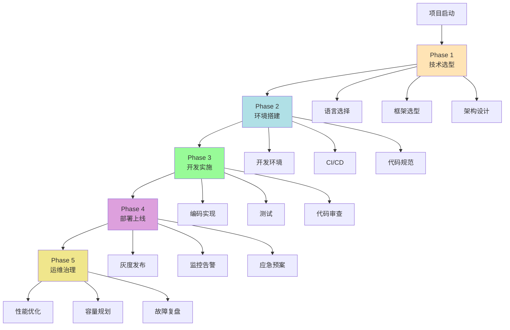

## Phase 1: 技术选型决策流程

### 1.1 编程语言选择

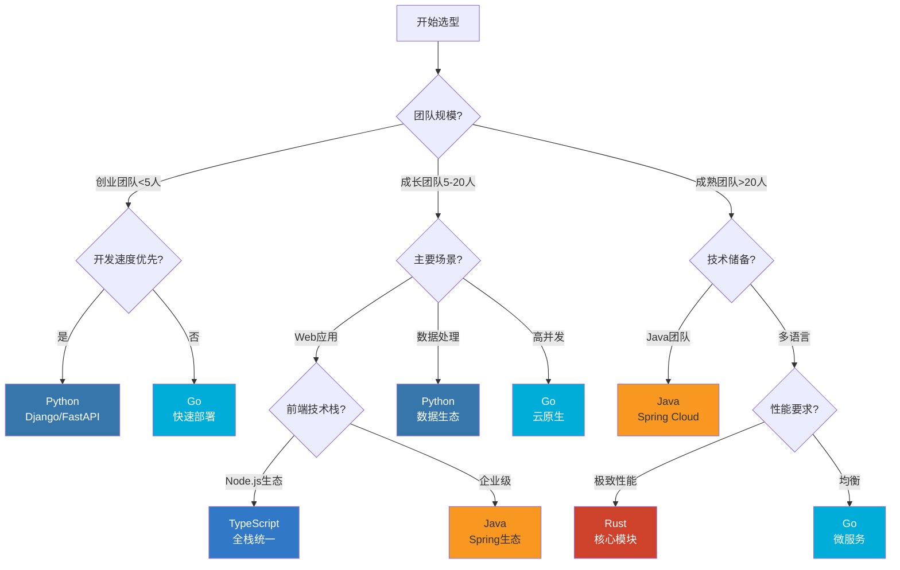

### 1.2 前端框架选择

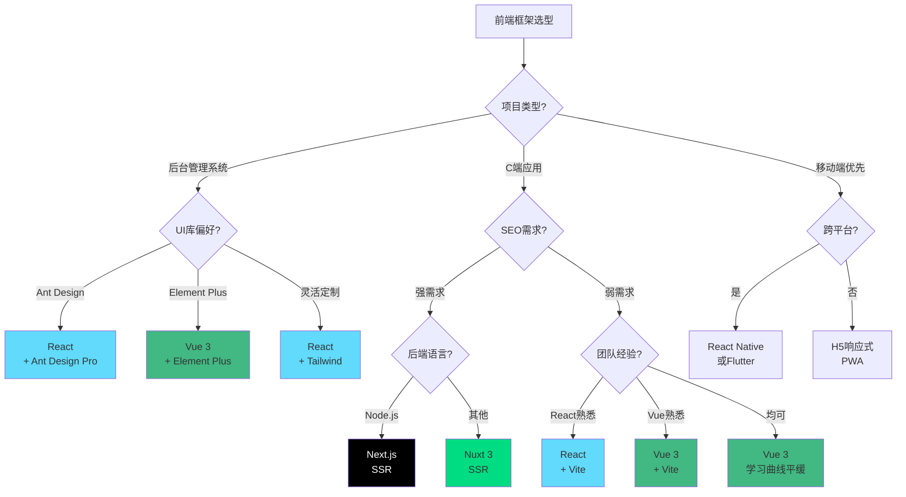

### 1.3 数据库选择

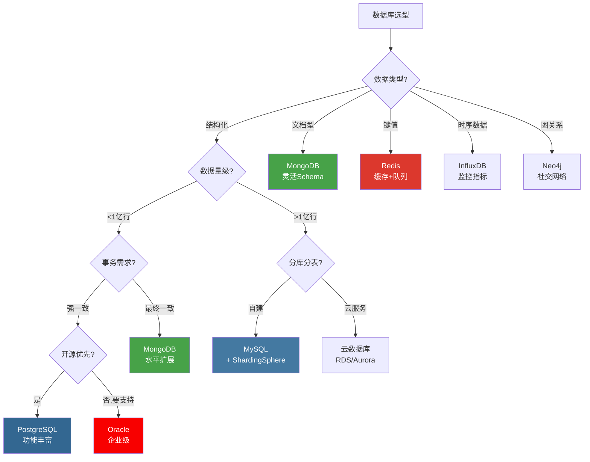

## Phase 2: 环境与工具链决策

### 2.1 开发环境选择

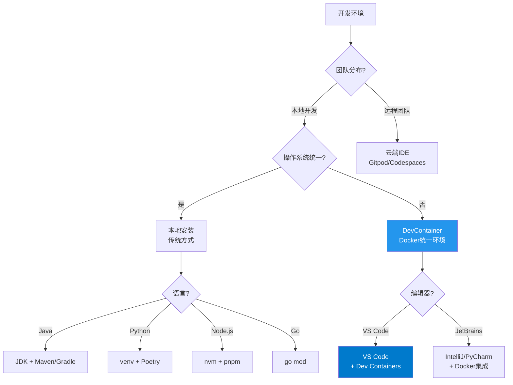

### 2.2 CI/CD工具链

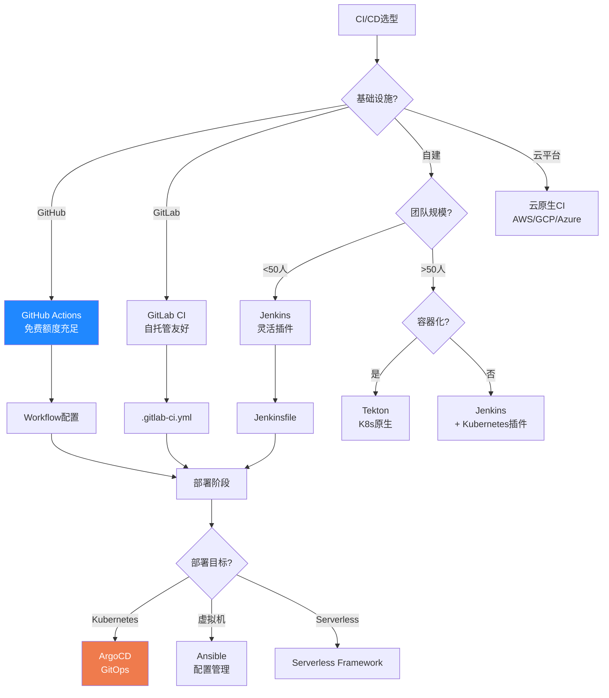

## Phase 3: 架构设计决策

### 3.1 应用架构模式

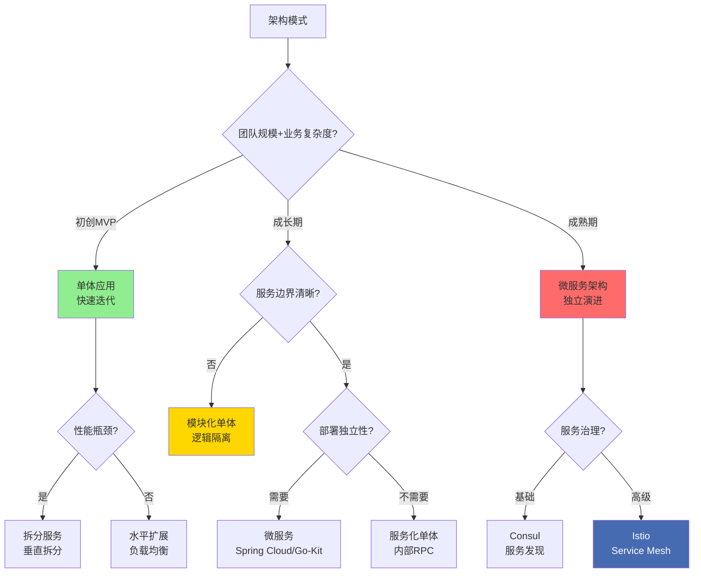

### 3.2 缓存策略

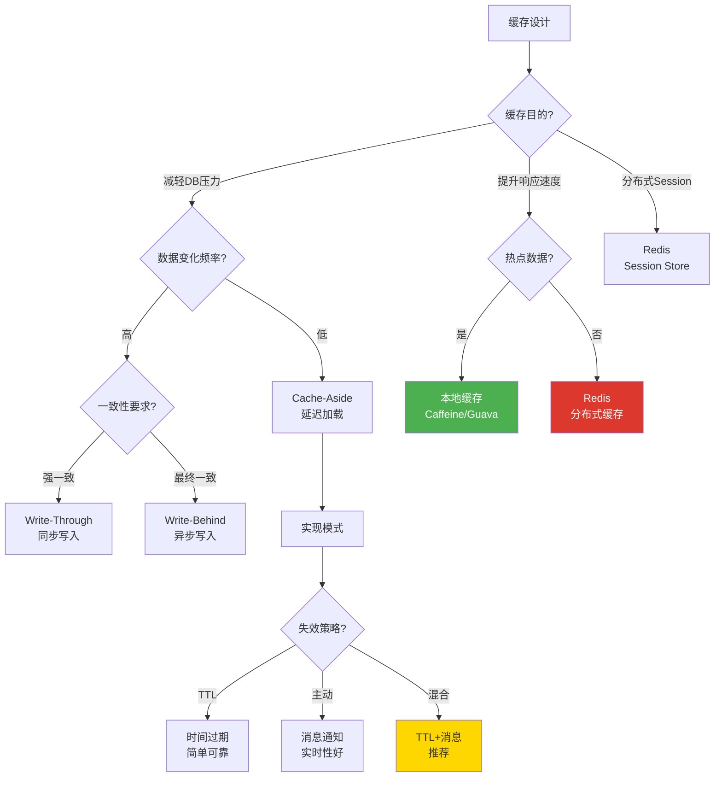

## Phase 4: 部署与发布决策

### 4.1 部署平台选择

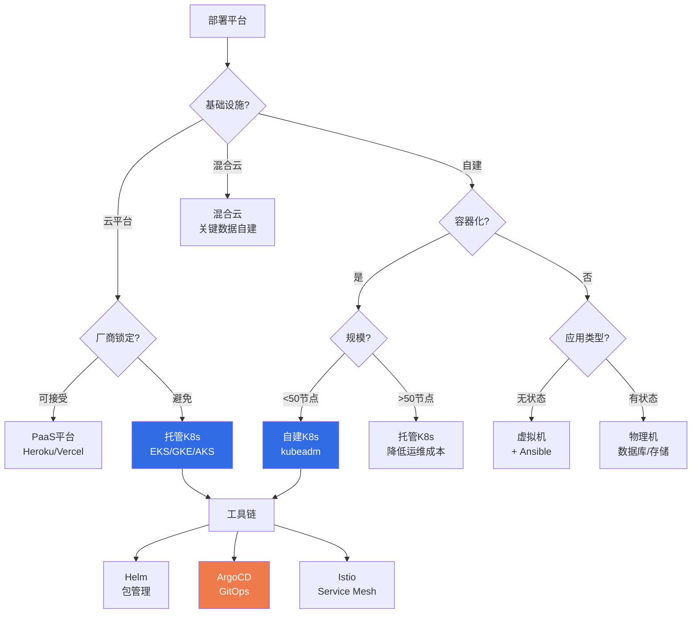

### 4.2 发布策略

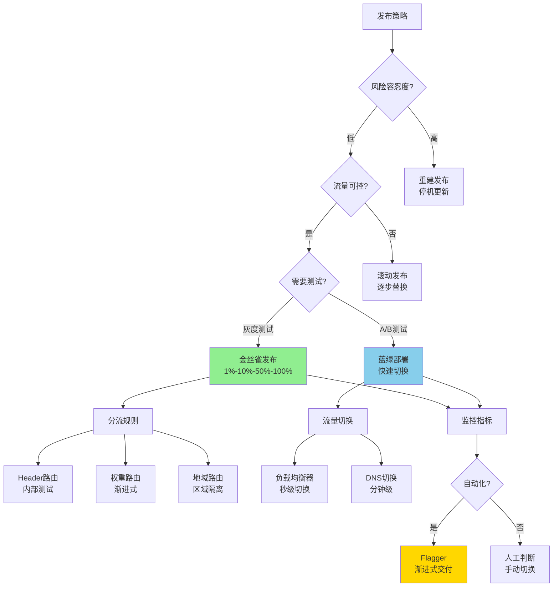

## Phase 5: 监控与治理决策

### 5.1 可观测性体系

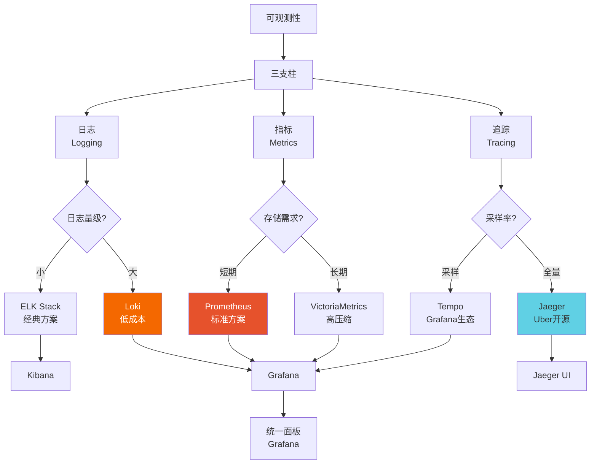

### 5.2 告警策略

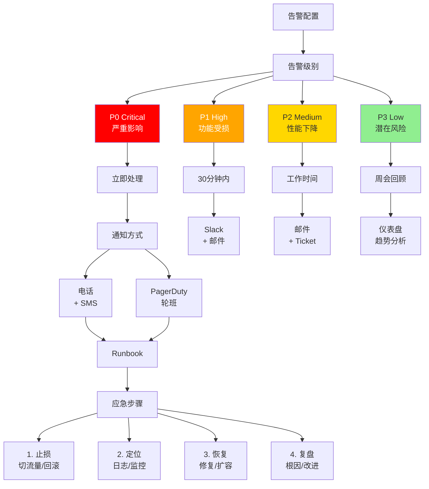

## 完整生命周期时间线

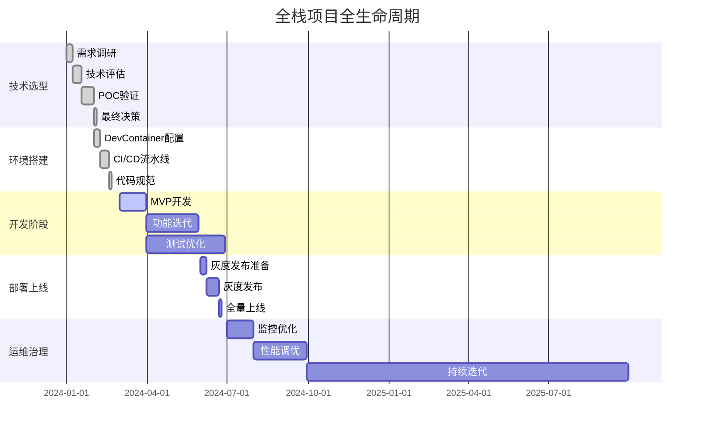

## 决策权重评分模型

### 综合评分公式

```yaml
技术选型评分 = Σ (因素权重 × 因素得分)

权重分配:
  团队熟悉度: 30%
  生态成熟度: 25%
  性能表现: 20%
  运维成本: 15%
  社区支持: 10%

示例评估:
  方案A (Spring Boot):
    团队熟悉度: 9/10 × 0.3 = 2.7
    生态成熟度: 10/10 × 0.25 = 2.5
    性能表现: 7/10 × 0.2 = 1.4
    运维成本: 6/10 × 0.15 = 0.9
    社区支持: 10/10 × 0.1 = 1.0
    总分: 8.5/10

  方案B (FastAPI):
    团队熟悉度: 5/10 × 0.3 = 1.5
    生态成熟度: 7/10 × 0.25 = 1.75
    性能表现: 9/10 × 0.2 = 1.8
    运维成本: 8/10 × 0.15 = 1.2
    社区支持: 8/10 × 0.1 = 0.8
    总分: 7.05/10
```

## 风险评估矩阵

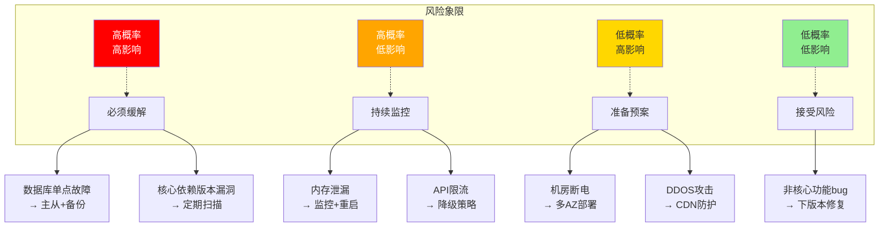

---

## 快速决策路径

### 1分钟快速决策

```markdown
## 创业团队 (0-1阶段)
- 语言: Python (FastAPI)
- 前端: Vue 3 + Element Plus
- 数据库: PostgreSQL
- 部署: Vercel/Railway (PaaS)
- 监控: Sentry + 云平台自带

## 成长团队 (1-10阶段)
- 语言: Java (Spring Boot) / Go
- 前端: React + Ant Design
- 数据库: MySQL + Redis
- 部署: Docker + K8s (托管)
- 监控: Prometheus + Grafana

## 成熟企业 (10-100阶段)
- 语言: Java (Spring Cloud)
- 前端: React + 自研组件库
- 数据库: 分库分表 + 读写分离
- 部署: K8s + Istio
- 监控: 全链路追踪 + APM
```

---

**文档版本**: v1.0
**最后更新**: 2025-11-13
**维护者**: 技术架构组
**适用范围**: 企业级Web应用、微服务架构、云原生应用
